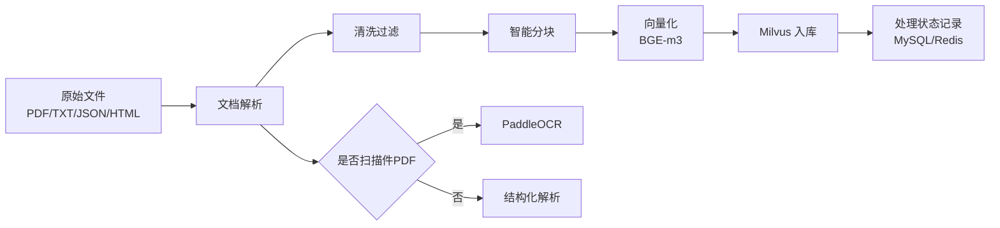
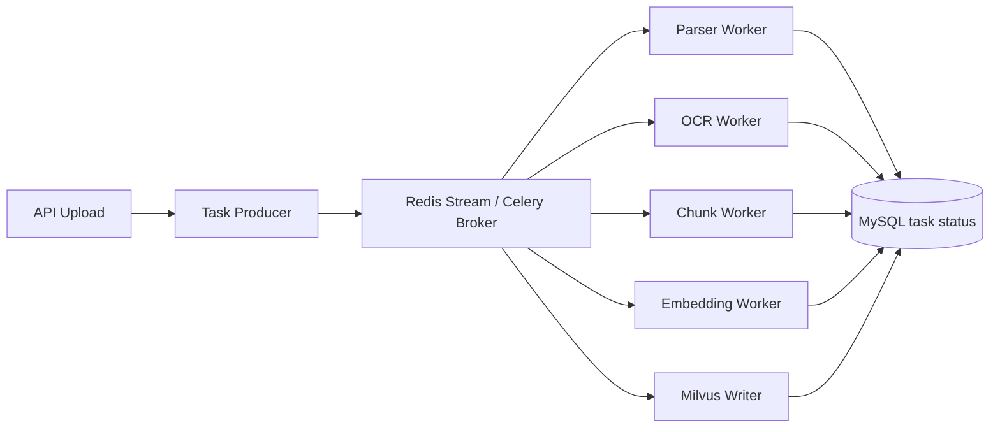

## 1. 整体技术架构图（Mermaid）

```
flowchart LR
	A[前端 Web / App / 小程序] --> B[负载均衡 Nginx / SLB]
    B --> C[API Gateway]
    C --> D[认证 / 限流 / 审计 / 灰度]
    D --> E[会话编排器 Agent Orchestrator]
    
    E --> F[角色管理<br/>预设角色 / 自定义角色 / 自动分配]
    F --> M[(MySQL<br/>用户/角色/Persona/知识库元数据)]
    
    E --> G[命名空间解析器<br/>{prefix}:{user_id}:{role_id}:{suffix}]
    G --> R[(Redis<br/>会话历史/短期记忆/召回缓存/任务状态)]
    
    E --> H[Query 改写]
    H --> I[多路召回路由]
    I --> J1[Dense Recall]
    I --> J2[Sparse / BM25 Recall]
    I --> J3[Session Memory Recall]
    I --> J4[Role Persona / Rules Recall]
    
    J1 --> V[(Milvus<br/>向量索引 + 稀疏索引)]
    J2 --> V
    J3 --> R
    J4 --> M
    
    V --> K[重排序 Rerank]
    R --> K
    M --> K
    
    K --> L[上下文构建<br/>Persona + 用户记忆 + TopK知识 + Guardrails]
    L --> N[LLM 路由]
    N --> O1[本地 LLM Serving]
    N -. 超时 / OOM / 降级 .-> O2[在线 API LLM]
    O1 --> P[流式生成答案]
    O2 --> P
    P --> A
    
    J1 -. uses .-> EM[Embedding Model]
    K -. uses .-> RM[Rerank Model]
    
    subgraph INGEST[知识库动态增量更新]
    	U[文件上传 / API导入 / 合规采集] --> X[解析/OCR/清洗/切块/去重]
    	X --> Y[Embedding 计算]
        Y --> V
        X --> M
        X --> R
    end 
```

补充约束建议：

- Redis 严格按

  {prefix}:{user_id}:{role_id}:{suffix} 

  命名，例如：

  - chat:1001:doctor:history
  - memory:1001:doctor:summary
  - rag:1001:doctor:topk_cache
  - ingest:1001:doctor:job_status

- MySQL / Milvus 也都带 user_id + role_id 过滤字段，查询时双重隔离，不只靠 Redis。

- Milvus 文档元数据建议包含：user_id, role_id, source, source_type, doc_id, chunk_id, version, updated_at。

------

## 2. 技术选型对比（最终推荐）

| 模块        | 候选方案                          | 推荐       | 核心理由                                                     |
| :---------- | :-------------------------------- | :--------- | :----------------------------------------------------------- |
| LLM推理部署 | sGLang / vLLM / xInference        | vLLM       | 吞吐和显存效率很强，OpenAI 兼容服务成熟，LoRA/量化/分布式支持完整，最适合作为主推理引擎；sGLang 极致性能更激进，但运维复杂度更高；Xinference 更像统一模型平台，不是最优“底层推理引擎”。 |
| RAG框架     | LangChain / LlamaIndex / 自研     | 自研       | 你的业务核心是“多租户 + 多角色 + 独立记忆 + 增量知识库 + 模型路由”，这些不该被框架绑死。LangChain/LlamaIndex 可借用 loader/reader，但核心检索编排建议自己写。 |
| 负载均衡    | Nginx / HAProxy / 云SLB           | Nginx      | 性能足够，配置和团队接手成本最低，适合本地部署和混合云；HAProxy 更偏高性能流量治理；云SLB 适合纯云但有厂商绑定。 |
| 混合检索    | Milvus内置 / Elasticsearch        | Milvus内置 | Milvus 已支持 BM25/full-text + dense hybrid，单系统运维成本更低；Elasticsearch 功能更全，但会引入双集群、双写、一致性和调优成本。 |
| 文档解析    | PaddleOCR / MinerU / Unstructured | PaddleOCR  | 中文 PDF、表格、公式识别能力最均衡；PP-StructureV3 官方对比里明显强于 Unstructured，也优于 MinerU 的多数复杂场景。 |

最终推荐栈：
Nginx + API Gateway + 自研RAG Core + MySQL + Redis + Milvus + PaddleOCR + vLLM + 在线API降级

------

## 3. 数据获取方案（具体可执行）

### 3.1 总表

截至 2026-04-25 我核对到：

- 中国裁判文书网 robots.txt 对 User-agent: * 为 Disallow: /
- 东方财富 robots.txt 为 Allow: /
- 中文维基 robots.txt 明确提醒不要高频抓取，且对部分动态路径有限制

| 角色类型 | 目标网站          | 获取方式                                                     | 预估数据量                      | 反爬对策                                                     |
| :------- | :---------------- | :----------------------------------------------------------- | :------------------------------ | :----------------------------------------------------------- |
| 律师     | 中国裁判文书网    | 不建议直爬；主数据用 CAIL2018/CAIL，裁判文书网仅人工补样核验 | 500+ 判例很容易，实际可到 2.6M+ | 不绕过 robots，不做代理池，不碰验证码；人工补样时 <= 1 req / 10s |
| 医生     | 国家卫健委官网    | 白名单栏目采集：疾病预防与控制 + 健康科普辟谣平台            | 500+ 疾病/科普条目              | 先检查 robots；若未提供明确规则，按最保守策略 0.2~0.5 rps，单线程，条件请求增量更新 |
| 股票专家 | 东方财富网        | sitemap + 财富号/博客/股吧 栏目分页抓取，正文抽取后去重      | 1000+ 股评语料                  | 0.5~1 rps，随机抖动，429/403 立即退避，按栏目错峰抓取        |
| 历史人物 | 维基百科/百度百科 | Wikipedia dump/API 为主；不建议把百度百科作为主采集源        | 100+ 人物传记非常轻松           | Wikipedia 以 dump 为主，少量 API 校验；Baidu Baike 不做绕过  |
| 游戏人物 | 游戏 wiki 站点    | 优先 MediaWiki API / categorymembers / export，不扫全站 DOM  | 200+ 角色设定                   | 0.2~0.5 rps，按分类分页，目标站点 403/429 立即停             |

### 3.2 爬虫 / 入库代码框架（关键逻辑）

#### 1. 律师：不直爬裁判文书网，改为公开数据集入库

```
import json 
import zipfile 
def iter_cail(zip_path: str):
	with zipfile.ZipFile(zip_path) as zf:
    	for name in zf.namelist():
        	if not name.endswith(".json"):
            	continue
            with zf.open(name) as f:
            	for line in f:
                	row = json.loads(line)
                    yield {
                    	"title": " / ".join(row["meta"].get("accusation", []))    								"content": row.get("fact", ""),
                        "source": "CAIL2018",
                        "tags": row.get("meta", {}),
                     } 
def build_lawyer_kb(user_id: str, role_id: str, zip_path: str, limit=5000):
	for i, doc in enumerate(iter_cail(zip_path)):
    	if i >= limit:
        	break
         upsert_rag_doc(user_id=user_id, role_id=role_id, doc=doc) 
```

替代方案：

- CAIL2018：https://cail.oss-cn-qingdao.aliyuncs.com/CAIL2018_ALL_DATA.zip
- 项目页：https://github.com/china-ai-law-challenge/CAIL2018

#### 2. 医生：国家卫健委栏目白名单采集

```
import asyncio 
import httpx from bs4 
import BeautifulSoup 

HDRS = {"User-Agent": "rag-bot/1.0 (contact: ops@example.com)"} 

def parse_nhc_list(html: str):
	soup = BeautifulSoup(html, "html.parser")    
	for a in soup.select("a"):
    	href = a.get("href", "")
        title = a.get_text(strip=True)
        if href.endswith(".shtml") and title:
        	yield {"url": href, "title": title}
    
def extract_nhc_article(html: str):
	soup = BeautifulSoup(html, "html.parser")
    title = soup.select_one("h1").get_text(strip=True)
    body = soup.get_text("\n", strip=True)
    return {"title": title, "content": body, "source": "nhc.gov.cn"}
    
async def crawl_nhc(user_id: str, role_id: str, pages=50):
	async with httpx.AsyncClient(headers=HDRS, timeout=20) as client:
    	for i in range(1, pages + 1):
        	list_url = f"https://www.nhc.gov.cn/wjw/jbyfykz/list_{i}.shtml"            				list_html = (await client.get(list_url)).text
            for item in parse_nhc_list(list_html):
            	if seen(item["url"]):
                	continue
                await asyncio.sleep(2.5)
                detail_html = (await client.get(item["url"])).text
                doc = extract_nhc_article(detail_html)
                upsert_rag_doc(user_id=user_id, role_id=role_id, doc=doc) 
```

#### 3. 股票专家：东方财富增量抓取

```
import asyncio 
import random 
import httpx from bs4 
import BeautifulSoup 

SEEDS = [    
	"https://blog.eastmoney.com/",
    "https://caifuhao.eastmoney.com/",
    "https://guba.eastmoney.com/", 
] 

def discover_article_urls(html: str):
	soup = BeautifulSoup(html, "html.parser")
    for a in soup.select("a[href]"):
    	url = a["href"]
        if "eastmoney.com" in url and any(k in url for k in ["/news/", "blog", "guba"]):            yield url 
        
def extract_stock_post(html: str):
	soup = BeautifulSoup(html, "html.parser")
    title = soup.select_one("h1").get_text(strip=True)
    body = soup.get_text("\n", strip=True)
    return {"title": title, "content": body, "source": "eastmoney"}
    
async def crawl_eastmoney(user_id: str, role_id: str):
	async with httpx.AsyncClient(timeout=20, follow_redirects=True) as client:
    	for seed in SEEDS:
        	seed_html = (await client.get(seed)).text
            for url in discover_article_urls(seed_html):
            	if seen(url):
                	continue
                await asyncio.sleep(random.uniform(1.0, 2.0))
                html = (await client.get(url)).text
                doc = extract_stock_post(html)
                if quality_ok(doc):
                	upsert_rag_doc(user_id=user_id, role_id=role_id, doc=doc) 
```

建议：

- 把 财富号/博客/股吧/研报 分开打标签，不要混成同权重知识。
- 生成阶段优先 官方公告/研报 > 博客 > 股吧评论。

#### 4. 历史人物：Wikipedia dump 为主，少量 API 校验

```
import mwxml

def iter_wiki_dump(dump_path: str):
	dump = mwxml.Dump.from_file(open(dump_path, "rb"))
    for page in dump:
    	title = page.title
        if not is_historical_person(title):
        	continue
        rev = next(page)
        text = rev.text or ""
        yield {           
        	"title": title,
            "content": text,
            "source": "zhwiki-dump",
        } 

def build_history_kb(user_id: str, role_id: str, dump_path: str, limit=2000):
	for i, doc in enumerate(iter_wiki_dump(dump_path)):
    	if i >= limit:
        	break
        upsert_rag_doc(user_id=user_id, role_id=role_id, doc=doc) 
```

替代方案：

- 中文维基 dump：https://dumps.wikimedia.org/zhwiki/latest/zhwiki-latest-pages-articles-multistream.xml.bz2

#### 5. 游戏人物：MediaWiki 类站点用 API，不扫站

```
import requests 

def crawl_game_wiki(api_base: str, category: str, user_id: str, role_id: str): 
	cmcontinue = None
    while True:
    	params = {
        	"action": "query", 
            "format": "json", 
            "list": "categorymembers",  
            "cmtitle": category,  
            "cmlimit": "50", 
        }        
        if cmcontinue: 
        	params["cmcontinue"] = cmcontinue     
        data = requests.get(api_base, params=params, timeout=20).json()         
        
        for page in data["query"]["categorymembers"]:           
        	text = fetch_page_wikitext(api_base, page["title"])            
        	doc = {"title": page["title"], "content": text, "source": api_base}   
            upsert_rag_doc(user_id=user_id, role_id=role_id, doc=doc)     
        
        cmcontinue = data.get("continue", {}).get("cmcontinue")       
        if not cmcontinue:        
        	break 
```

### 3.3 robots.txt 合规与频率限制

统一规则：

- 先读 robots.txt，禁止就不抓。
- 只抓公开页面，不登录、不绕验证码、不做代理池。
- 403/429 立即指数退避，连续失败直接停任务。
- 优先 API / dump / sitemap / RSS，其次才是 HTML。
- 只做增量抓取：ETag / If-Modified-Since / 正文哈希去重 / 断点续采。

建议频率：

- 裁判文书网：不抓
- 国家卫健委：0.2~0.5 rps
- 东方财富：0.5~1 rps
- Wikipedia live API：<= 1 rps，但更推荐 dump
- 游戏 wiki：0.2~0.5 rps

------

**参考来源**

- vLLM 文档：https://docs.vllm.ai/
- SGLang 文档：https://docs.sglang.io/
- Xinference：https://xinference.io/
- LangChain Retrieval：https://docs.langchain.com/oss/python/langchain/retrieval
- LlamaIndex 文档：https://docs.llamaindex.ai/
- Milvus Full Text / Hybrid：https://milvus.io/docs/full-text-search.md
- PaddleOCR PP-StructureV3：https://www.paddleocr.ai/main/en/version3.x/algorithm/PP-StructureV3/PP-StructureV3.html
- NGINX Load Balancer：https://docs.nginx.com/nginx/admin-guide/load-balancer/
- HAProxy 文档：https://docs.haproxy.org/
- 中国裁判文书网 robots：https://wenshu.court.gov.cn/robots.txt
- 东方财富 robots：https://www.eastmoney.com/robots.txt
- 东方财富 sitemap：https://www.eastmoney.com/sitemap.html
- 国家卫健委疾病预防与控制栏目：https://www.nhc.gov.cn/wjw/jbyfykz/list_3.shtml
- 国家卫健委健康科普辟谣平台：https://www.nhc.gov.cn/kppypt/index.shtml
- CAIL2018：https://github.com/china-ai-law-challenge/CAIL2018
- MediaWiki API：https://www.mediawiki.org/wiki/API:Main_page
- Wikimedia dumps：https://www.mediawiki.org/wiki/Manual:Pywikibot/Cookbook/Working_with_dumps


## 4. 数据处理 Pipeline 设计

### 4.1 流程图（Mermaid）




### 4.2 模块输入输出定义

| 模块         | 输入                                                         | 输出                    | 核心处理                                                     |
| :----------- | :----------------------------------------------------------- | :---------------------- | :----------------------------------------------------------- |
| 原始文件接入 | file_id, user_id, role_id, source_type, file_name, mime_type, raw_bytes/source_url | RawDocument             | 文件上传、URL导入、批量采集任务                              |
| 文档解析     | RawDocument                                                  | ParsedDocument          | PDF/TXT/JSON/HTML 统一解析；扫描件 PDF 自动 OCR；保留标题、段落、表格、层级 |
| 清洗过滤     | ParsedDocument                                               | CleanDocument           | 去页眉页脚、广告、URL、乱码；敏感词过滤；短文本过滤          |
| 智能分块     | CleanDocument                                                | Chunk[]                 | 按语义边界切分，256~512 token，10% overlap，保留 chunk 元数据 |
| 向量化       | Chunk[]                                                      | VectorRecord[]          | 用 BGE-m3 生成 1024 维向量；batch size 按显存自适应          |
| 入库         | VectorRecord[]                                               | MilvusEntity[] / status | 全量导入或增量 upsert；记录处理状态、版本、时间戳            |

### 4.3 建议的数据结构

```
RawDocument: 
- file_id: str 
- user_id: str 
- role_id: str 
- source_type: file/url/crawler/api 
- file_name: str 
- mime_type: str
- source_uri: str 
- raw_bytes: bytes | null 
- created_at: int64 

ParsedDocument: 
- doc_id: str 
- user_id: str 
- role_id: str 
- title: str 
- sections: list[{level, heading, content}]
- tables: list[{caption, html/text}] 
- plain_text: str 
- source_uri: str 
- parser: pdfminer/paddleocr/html/json 
- parse_time: int64 

CleanDocument: 
- doc_id: str 
- user_id: str 
- role_id: str 
- clean_text: str 
- removed_items: list[str] 
- is_rejected: bool 
- reject_reason: str | null 

Chunk: 
- chunk_id: str 
- doc_id: str 
- user_id: str 
- role_id: str 
- chunk_text: str 
- token_count: int 
- chunk_index: int 
- overlap_from_prev: int 
- metadata: {title, heading_path, source_uri, file_name, category, updated_at} 

VectorRecord: 
- id: str 
- tenant_key: "{user_id}:{role_id}" 
- role_category: str 
- text: str 
- embedding: float[1024] 
- source: str 
- doc_id: str 
- chunk_id: str 
- created_at: int64 
- updated_at: int64 
```

### 4.4 各模块设计要求落地

**文档解析模块**

- 支持 PDF / TXT / JSON / HTML
- PDF 先做文本层检测：有文本层直接解析；无文本层判定为扫描件，走 PaddleOCR
- 输出统一为结构化文档对象，保留：
  - title
  - heading_path
  - paragraphs
  - tables
  - source_uri

**清洗过滤模块**

- 去除内容：
  - 页眉页脚
  - 广告区块
  - 特殊字符和连续空白
  - 裸 URL
- 过滤规则：
  - 敏感词命中即丢弃或脱敏
  - 文本长度 <20 字直接丢弃
  - 重复文本按 simhash + doc_id + source_hash 去重

**智能分块模块**

- 主策略：按标题、段落、句号、问号、分号等语义边界切分
- 块大小：256~512 token
- overlap：10%
- 若表格过大：单表单块或“表头 + 若干行”切块
- 每个 chunk 必带原文元数据：
  - user_id
  - role_id
  - doc_id
  - chunk_id
  - heading_path
  - source_uri
  - updated_at

**向量化模块**

- 模型：BAAI/bge-m3
- 输出维度：1024
- batch size 自适应建议：
  - free_mem < 8GB -> batch=8
  - 8~16GB -> batch=16~32
  - \>16GB -> batch=32~64
- 生产上按 torch.cuda.mem_get_info() 动态调整，OOM 自动降半重试

**入库模块**

- 全量模式：
  - 按 tenant_key 或 doc_id 批量删旧数据
  - 再批量插入新 chunk
- 增量模式：
  - 推荐 doc_id + chunk_id 级别 upsert
  - 若 SDK/版本不便 upsert，则按 doc_id 先删后插
- 状态记录：
  - doc_id
  - status: pending/processing/success/failed
  - processed_at
  - error_message
  - version

------

## 5. 数据库 Schema 设计

### 5.1 MySQL（完整建表 SQL）

说明：

- role_id 建议统一为逻辑 ID，例如 preset:1、custom:10023
- 这样 conversations 和 user_role_mapping 不需要跨两张角色表做多态外键

```
CREATE TABLE `users` (  
`id` BIGINT UNSIGNED NOT NULL AUTO_INCREMENT,  
`username` VARCHAR(64) NOT NULL,  
`password_hash` VARCHAR(255) NOT NULL,  
`email` VARCHAR(128) DEFAULT NULL,  
`created_at` DATETIME NOT NULL DEFAULT CURRENT_TIMESTAMP,  
PRIMARY KEY (`id`),  
UNIQUE KEY `idx_username` (`username`) 
) ENGINE=InnoDB DEFAULT CHARSET=utf8mb4 COLLATE=utf8mb4_unicode_ci; 

CREATE TABLE `preset_roles` (  
`id` BIGINT UNSIGNED NOT NULL AUTO_INCREMENT, 
`name` VARCHAR(64) NOT NULL,  
`category` VARCHAR(32) NOT NULL,  
`system_prompt` MEDIUMTEXT NOT NULL,  
`knowledge_base_id` VARCHAR(64) DEFAULT NULL,  
`created_at` DATETIME NOT NULL DEFAULT CURRENT_TIMESTAMP,  
`updated_at` DATETIME NOT NULL DEFAULT CURRENT_TIMESTAMP ON UPDATE CURRENT_TIMESTAMP, 
PRIMARY KEY (`id`),  
KEY `idx_category` (`category`) 
) ENGINE=InnoDB DEFAULT CHARSET=utf8mb4 COLLATE=utf8mb4_unicode_ci; 

CREATE TABLE `custom_roles` (  
`id` BIGINT UNSIGNED NOT NULL AUTO_INCREMENT, 
`user_id` BIGINT UNSIGNED NOT NULL,  
`name` VARCHAR(64) NOT NULL,  
`system_prompt` MEDIUMTEXT NOT NULL, 
`created_at` DATETIME NOT NULL DEFAULT CURRENT_TIMESTAMP, 
`updated_at` DATETIME NOT NULL DEFAULT CURRENT_TIMESTAMP ON UPDATE CURRENT_TIMESTAMP, 
PRIMARY KEY (`id`), 
KEY `idx_user_id` (`user_id`),  
CONSTRAINT `fk_custom_roles_user_id`    
  FOREIGN KEY (`user_id`) REFERENCES `users` (`id`)    
  ON DELETE CASCADE ON UPDATE CASCADE 
) ENGINE=InnoDB DEFAULT CHARSET=utf8mb4 COLLATE=utf8mb4_unicode_ci;

CREATE TABLE `conversations` (  
`id` BIGINT UNSIGNED NOT NULL AUTO_INCREMENT, 
`user_id` BIGINT UNSIGNED NOT NULL,  
`role_id` VARCHAR(64) NOT NULL, 
`query` MEDIUMTEXT NOT NULL, 
`response` MEDIUMTEXT NOT NULL, 
`tokens_used` INT UNSIGNED NOT NULL DEFAULT 0, 
`timestamp` DATETIME NOT NULL DEFAULT CURRENT_TIMESTAMP, 
PRIMARY KEY (`id`),  
KEY `idx_user_role_time` (`user_id`, `role_id`, `timestamp`),
CONSTRAINT `fk_conversations_user_id`   
  FOREIGN KEY (`user_id`) REFERENCES `users` (`id`)  
  ON DELETE CASCADE ON UPDATE CASCADE 
) ENGINE=InnoDB DEFAULT CHARSET=utf8mb4 COLLATE=utf8mb4_unicode_ci; 

CREATE TABLE `user_role_mapping` ( 
`user_id` BIGINT UNSIGNED NOT NULL, 
`role_id` VARCHAR(64) NOT NULL,  
`last_used_at` DATETIME NOT NULL DEFAULT CURRENT_TIMESTAMP, 
`total_interactions` INT UNSIGNED NOT NULL DEFAULT 0,  
PRIMARY KEY (`user_id`, `role_id`),  
KEY `idx_user_role` (`user_id`, `role_id`), 
CONSTRAINT `fk_user_role_mapping_user_id`  
  FOREIGN KEY (`user_id`) REFERENCES `users` (`id`) 
  ON DELETE CASCADE ON UPDATE CASCADE
) ENGINE=InnoDB DEFAULT CHARSET=utf8mb4 COLLATE=utf8mb4_unicode_ci; 
```

### 5.2 Redis Key 设计

注意：你给的 cache:query:{query_hash} 不满足你自己的强约束 {prefix}:{user_id}:{role_id}:{suffix}。
如果要求严格隔离，建议统一改成下面这一版。

| Key模式                                | 类型    | TTL   | 说明                |
| :------------------------------------- | :------ | :---- | :------------------ |
| chat:{user_id}:{role_id}:recent        | List    | 24h   | 最近 10 轮对话      |
| chat:{user_id}:{role_id}:session       | String  | 30min | 当前 session_id     |
| ratelimit:{user_id}:{role_id}:minute   | Integer | 60s   | 每分钟请求计数      |
| cache:{user_id}:{role_id}:{query_hash} | String  | 1h    | 用户+角色级查询缓存 |
| memory:{user_id}:{role_id}:summary     | String  | 7d    | 长期记忆摘要        |
| ingest:{user_id}:{role_id}:{doc_id}    | Hash    | 7d    | 文档处理状态        |
| lock:{user_id}:{role_id}:ingest        | String  | 5min  | 增量更新分布式锁    |

如果你确实需要“跨用户共享公共查询缓存”，那要显式定义为例外键：

- cache:global:preset:{query_hash}
  这类缓存只能用于“公共预设角色 + 公共知识库”，不能用于用户私有角色。

### 5.3 Milvus Collection 设计

先给结论：

- 你表里的 role_category 不能单独作为分区键，因为它无法满足“多用户 + 多角色隔离”
- 生产上必须新增 tenant_key = "{user_id}:{role_id}" 作为 partition key
- role_category 保留为普通过滤字段

#### 推荐字段

| 字段名        | 类型           | 维度 | 索引类型 | 说明                 |
| :------------ | :------------- | :--- | :------- | :------------------- |
| id            | VARCHAR(64)    | -    | 主键     | 唯一 ID              |
| tenant_key    | VARCHAR(128)   | -    | 分区键   | {user_id}:{role_id}  |
| role_category | VARCHAR(32)    | -    | 标量过滤 | 律师/医生/历史人物等 |
| text          | VARCHAR(65535) | -    | -        | chunk 文本           |
| embedding     | FLOAT_VECTOR   | 1024 | IVF_FLAT | BGE-m3 向量          |
| source        | VARCHAR(512)   | -    | -        | 来源 URL / 文件      |
| doc_id        | VARCHAR(64)    | -    | 标量过滤 | 源文档 ID            |
| chunk_id      | VARCHAR(64)    | -    | 标量过滤 | 分块 ID              |
| created_at    | INT64          | -    | -        | 创建时间戳           |
| updated_at    | INT64          | -    | -        | 更新时间戳           |

#### 创建 Collection 的完整代码（Python / pymilvus）

```
from pymilvus import MilvusClient, DataType 

MILVUS_URI = "http://localhost:19530" 
TOKEN = "root:Milvus" 
COLLECTION_NAME = "rag_chunks" 

client = MilvusClient(uri=MILVUS_URI, token=TOKEN) 

if client.has_collection(collection_name=COLLECTION_NAME):   
	client.drop_collection(collection_name=COLLECTION_NAME) 
	
schema = MilvusClient.create_schema(    
	auto_id=False,   
    enable_dynamic_field=False, 
) 

schema.add_field(  
	field_name="id",   
    datatype=DataType.VARCHAR,  
    is_primary=True,  
    max_length=64, 
) 

schema.add_field(  
	field_name="tenant_key",  
    datatype=DataType.VARCHAR,    
    max_length=128,  
    is_partition_key=True, 
) 

schema.add_field(  
	field_name="role_category",  
    datatype=DataType.VARCHAR,  
    max_length=32, 
) 

schema.add_field(  
	field_name="text", 
    datatype=DataType.VARCHAR,  
    max_length=65535, 
) 

schema.add_field(  
	field_name="embedding",  
    datatype=DataType.FLOAT_VECTOR,  
    dim=1024, 
) 
    
schema.add_field(   
    field_name="source",  
    datatype=DataType.VARCHAR,  
    max_length=512, 
) 
    
schema.add_field( 
    field_name="doc_id",   
    datatype=DataType.VARCHAR,   
    max_length=64, 
) 
    
schema.add_field(  
    field_name="chunk_id",   
    datatype=DataType.VARCHAR, 
    max_length=64, 
) 
    
schema.add_field(   
    field_name="created_at",  
    datatype=DataType.INT64, 
) 
    
schema.add_field(  
    field_name="updated_at", 
    datatype=DataType.INT64,
) 
    
index_params = MilvusClient.prepare_index_params()
index_params.add_index(    
	field_name="embedding",  
    index_name="idx_embedding_ivf_flat",
    index_type="IVF_FLAT",   
    metric_type="COSINE",   
    params={"nlist": 2048}, 
) 

client.create_collection(  
	collection_name=COLLECTION_NAME,   
    schema=schema,   
    index_params=index_params, 
) 

client.load_collection(collection_name=COLLECTION_NAME)
print(f"Collection `{COLLECTION_NAME}` created and loaded.") 
```

#### 插入与增量更新建议

```
def build_entity(chunk):   
	return {     
    	"id": chunk["id"],    
        "tenant_key": f'{chunk["user_id"]}:{chunk["role_id"]}',    
        "role_category": chunk["role_category"],      
        "text": chunk["text"],    
        "embedding": chunk["embedding"],   # len == 1024    
        "source": chunk["source"],     
        "doc_id": chunk["doc_id"],      
        "chunk_id": chunk["chunk_id"],     
        "created_at": chunk["created_at"],    
        "updated_at": chunk["updated_at"],  
    } 
    
def full_rebuild(client, collection_name, tenant_key, entities):  
	client.delete(     
    	collection_name=collection_name,      
        filter=f'tenant_key == "{tenant_key}"'   
    )   
    client.insert(collection_name=collection_name, data=entities)
    
def incremental_upsert(client, collection_name, doc_id, entities): 
	client.delete(    
    	collection_name=collection_name,    
        filter=f'doc_id == "{doc_id}"'   
    )   
    client.insert(collection_name=collection_name, data=entities) 
```

**参考**

- Milvus Create Collection、Schema、IVF_FLAT、Partition Key 官方文档：https://milvus.io/docs/
- BAAI/bge-m3 官方模型卡：https://huggingface.co/BAAI/bge-m3


## 6. 核心 API 定义（OpenAPI 3.0）

下面这版是可直接落到 openapi.yaml 的精简契约，重点覆盖你列出的 7 个接口。

```
openapi: 3.0.3
info:
  title: Multi-Role RAG API
  version: 1.0.0

servers:
  - url: https://api.example.com

paths:
  /api/v1/chat:
    post:
      summary: 多轮对话（支持流式）
      requestBody:
        required: true
        content:
          application/json:
            schema:
              oneOf:
                - $ref: "#/components/schemas/ChatByRoleIdRequest"
                - $ref: "#/components/schemas/ChatByRoleNameRequest"
      responses:
        "200":
          description: 非流式返回
          content:
            application/json:
              schema:
                $ref: "#/components/schemas/ChatResponse"
        "206":
          description: 流式返回（SSE）
          content:
            text/event-stream:
              schema:
                type: string

  /api/v1/roles:
    get:
      summary: 获取角色列表
      parameters:
        - in: query
          name: user_id
          schema:
            type: string
          required: false
          description: 为空时仅返回预设角色；有值时返回预设+该用户自定义角色
      responses:
        "200":
          description: 角色列表
          content:
            application/json:
              schema:
                $ref: "#/components/schemas/RolesListResponse"

  /api/v1/roles/detect:
    post:
      summary: 自动识别/创建角色
      requestBody:
        required: true
        content:
          application/json:
            schema:
              $ref: "#/components/schemas/RoleDetectRequest"
      responses:
        "200":
          description: 识别结果
          content:
            application/json:
              schema:
                $ref: "#/components/schemas/RoleDetectResponse"

  /api/v1/roles/custom:
    post:
      summary: 创建自定义角色
      requestBody:
        required: true
        content:
          application/json:
            schema:
              $ref: "#/components/schemas/CreateCustomRoleRequest"
      responses:
        "200":
          description: 创建结果
          content:
            application/json:
              schema:
                $ref: "#/components/schemas/RoleResponse"

  /api/v1/chat/clear:
    post:
      summary: 清除短期记忆
      requestBody:
        required: true
        content:
          application/json:
            schema:
              $ref: "#/components/schemas/ClearChatRequest"
      responses:
        "200":
          description: 清除结果
          content:
            application/json:
              schema:
                $ref: "#/components/schemas/ClearChatResponse"

  /api/v1/knowledge/upload:
    post:
      summary: 知识库上传
      requestBody:
        required: true
        content:
          multipart/form-data:
            schema:
              type: object
              required: [user_id, role_id, file]
              properties:
                user_id:
                  type: string
                role_id:
                  type: string
                mode:
                  type: string
                  enum: [full, incremental]
                  default: incremental
                file:
                  type: string
                  format: binary
      responses:
        "200":
          description: 上传成功，返回异步处理任务
          content:
            application/json:
              schema:
                $ref: "#/components/schemas/KnowledgeUploadResponse"

  /api/v1/health:
    get:
      summary: 健康检查
      responses:
        "200":
          description: 服务健康状态
          content:
            application/json:
              schema:
                $ref: "#/components/schemas/HealthResponse"

components:
  schemas:
    ChatByRoleIdRequest:
      type: object
      required: [user_id, role_id, query, stream]
      properties:
        user_id:
          type: string
        role_id:
          type: string
          description: 预设角色ID或自定义角色ID
        query:
          type: string
        stream:
          type: boolean
        session_id:
          type: string
        top_k:
          type: integer
          default: 8
        temperature:
          type: number
          format: float
          default: 0.7

    ChatByRoleNameRequest:
      type: object
      required: [user_id, role_name, query, stream]
      properties:
        user_id:
          type: string
        role_name:
          type: string
          description: 若不存在则触发角色匹配或自动创建
        query:
          type: string
        stream:
          type: boolean
        session_id:
          type: string
        top_k:
          type: integer
          default: 8
        temperature:
          type: number
          format: float
          default: 0.7

    ChatResponse:
      type: object
      properties:
        request_id:
          type: string
        role_id:
          type: string
        role_name:
          type: string
        session_id:
          type: string
        response:
          type: string
        context_sources:
          type: array
          items:
            $ref: "#/components/schemas/ContextSource"
        tokens_used:
          type: integer
        latency_ms:
          type: integer
        model:
          type: string
        degraded_to_online_api:
          type: boolean

    ContextSource:
      type: object
      properties:
        doc_id:
          type: string
        chunk_id:
          type: string
        source:
          type: string
        score:
          type: number
          format: float

    RolesListResponse:
      type: object
      properties:
        total:
          type: integer
        items:
          type: array
          items:
            $ref: "#/components/schemas/RoleResponse"

    RoleResponse:
      type: object
      properties:
        role_id:
          type: string
        name:
          type: string
        category:
          type: string
        role_type:
          type: string
          enum: [preset, custom, auto]
        system_prompt:
          type: string
        knowledge_base_id:
          type: string
        created_at:
          type: string
          format: date-time

    RoleDetectRequest:
      type: object
      required: [user_id, query]
      properties:
        user_id:
          type: string
        query:
          type: string

    RoleDetectResponse:
      type: object
      properties:
        role_id:
          type: string
        role_name:
          type: string
        category:
          type: string
        action:
          type: string
          enum: [matched, created, assigned]
        confidence:
          type: number
          format: float
        reason:
          type: string

    CreateCustomRoleRequest:
      type: object
      required: [user_id, name, system_prompt]
      properties:
        user_id:
          type: string
        name:
          type: string
        category:
          type: string
        system_prompt:
          type: string
        knowledge_base_id:
          type: string

    ClearChatRequest:
      type: object
      required: [user_id, role_id]
      properties:
        user_id:
          type: string
        role_id:
          type: string

    ClearChatResponse:
      type: object
      properties:
        success:
          type: boolean
        cleared_keys:
          type: array
          items:
            type: string
        session_id:
          type: string
          nullable: true

    KnowledgeUploadResponse:
      type: object
      properties:
        task_id:
          type: string
        user_id:
          type: string
        role_id:
          type: string
        mode:
          type: string
        status:
          type: string
          enum: [queued, processing, success, failed]
        uploaded_at:
          type: string
          format: date-time

    HealthResponse:
      type: object
      properties:
        status:
          type: string
          enum: [ok, degraded, down]
        version:
          type: string
        services:
          type: object
          properties:
            mysql:
              type: string
            redis:
              type: string
            milvus:
              type: string
            llm_local:
              type: string
            llm_online_fallback:
              type: string
```

接口语义建议：

- /api/v1/chat 的 role_id 和 role_name 二选一。
- stream=true 时返回 text/event-stream，事件建议为：start、delta、source、end、error。
- /api/v1/knowledge/upload 建议异步，上传后只返回 task_id，避免长连接阻塞。

------

## 7. RAG 优化策略落地（Phase 1）

| 策略                       | 是否包含 | 实现位置                | 简要说明                                                     |
| :------------------------- | :------- | :---------------------- | :----------------------------------------------------------- |
| Query改写（多轮指代消解）  | ✅        | query_rewrite_service   | 先结合最近 3~5 轮对话做指代补全，再送检索。                  |
| 多路召回（语义+BM25+HyDE） | ❌        | retrieval_router        | Phase 1 只做 Dense + BM25 + Session Memory，HyDE 延后到 Phase 2，避免额外 LLM 开销。 |
| RRF融合排序                | ✅        | retrieval_fusion        | 将 dense / BM25 / memory 结果统一做 RRF 融合。               |
| BGE-rerank重排序           | ✅        | rerank_service          | 融合后 TopN 再用 BGE-reranker 精排。                         |
| 上下文压缩/选择性召回      | ✅        | context_builder         | 只保留高相关 chunk，并按 token budget 裁剪。                 |
| 流式输出（SSE）            | ✅        | chat_controller         | API 层直接支持 text/event-stream。                           |
| 语义分块+重叠              | ✅        | ingest_pipeline/chunker | 256~512 token，10% overlap。                                 |
| 常见Query缓存              | ✅        | redis_cache             | 按 cache:{user_id}:{role_id}:{query_hash} 缓存热点问答。     |
| 结构化日志输出             | ✅        | api_gateway + rag_core  | JSON 日志，打通 request_id / user_id / role_id / trace_id。  |
| Prompt缓存（前缀缓存）     | ❌        | llm_gateway             | Phase 1 不强依赖；后续可结合 vLLM prefix caching 再开。      |

Phase 1 的建议边界：

- 必做：Query Rewrite + Dense/BM25 + RRF + Rerank + SSE + Cache
- 延后：HyDE + Prefix Cache + Self-RAG / Reflection

------

## 8. 评测与压测方案

### 8.1 RAGAS 评测

测试集要求：

- 50 条 query
- 每条数据包含：
  - question
  - expected_answer
  - expected_context
- 线上跑一遍实际 RAG，产出：
  - answer
  - retrieved_contexts

通过标准：

- faithfulness > 0.7
- answer_relevancy > 0.7
- context_recall > 0.7
- context_precision > 0.7

评测代码框架：

```
from datasets import Dataset
from ragas import evaluate
from ragas.metrics import faithfulness, answer_relevancy, context_recall, context_precision
import requests
import json

CHAT_API = "http://localhost:8000/api/v1/chat"

def load_eval_set(path: str):
    with open(path, "r", encoding="utf-8") as f:
        return json.load(f)

def call_rag_api(user_id: str, role_id: str, question: str):
    payload = {
        "user_id": user_id,
        "role_id": role_id,
        "query": question,
        "stream": False
    }
    resp = requests.post(CHAT_API, json=payload, timeout=120)
    resp.raise_for_status()
    data = resp.json()
    return {
        "answer": data["response"],
        "retrieved_contexts": [x.get("source", "") for x in data.get("context_sources", [])]
    }

def build_ragas_dataset(eval_items, user_id="eval_user", role_id="doctor_01"):
    rows = []
    for item in eval_items:
        result = call_rag_api(user_id=user_id, role_id=role_id, question=item["question"])
        rows.append({
            "question": item["question"],
            "ground_truth": item["expected_answer"],
            "contexts": item["expected_context"],
            "answer": result["answer"],
        })
    return Dataset.from_list(rows)

def main():
    eval_items = load_eval_set("eval_set.json")
    dataset = build_ragas_dataset(eval_items)

    result = evaluate(
        dataset,
        metrics=[faithfulness, answer_relevancy, context_recall, context_precision],
    )

    print(result)
    df = result.to_pandas()
    print(df.head())

    summary = result.to_pandas().mean(numeric_only=True).to_dict()
    print("summary:", summary)

    gates = {
        "faithfulness": 0.7,
        "answer_relevancy": 0.7,
        "context_recall": 0.7,
        "context_precision": 0.7,
    }

    failed = {k: v for k, v in summary.items() if k in gates and v < gates[k]}
    if failed:
        raise SystemExit(f"Evaluation failed: {failed}")

if __name__ == "__main__":
    main()
```

eval_set.json 样例：

```
[
  {
    "question": "我的劳动合同到期后公司不续签，能要求赔偿吗？",
    "expected_answer": "若满足法定条件，可主张经济补偿或赔偿。",
    "expected_context": [
      "劳动合同法关于合同终止和经济补偿的条款",
      "相关司法解释或判例摘要"
    ]
  }
]

```

补充建议：

- 评测要按角色拆桶：lawyer / doctor / stock / history
- 评测前固定 top_k / rerank_top_n / prompt version
- 每次发布保留一份 eval_result_<date>.json

### 8.2 压力测试

假设：

- 平均输入 150~250 tokens
- 平均输出 200~400 tokens
- Phase 1 使用 vLLM + BGE-m3 + BGE-reranker + Milvus

| 场景 | 并发用户数 | 持续时间 | 预期QPS | P99延迟 | 错误率 |
| :--- | :--------- | :------- | :------ | :------ | :----- |
| 轻载 | 10         | 2分钟    | 4       | <2s     | <0.5%  |
| 中载 | 50         | 5分钟    | 15      | <3s     | <1%    |
| 重载 | 100        | 5分钟    | 25      | <5s     | <2%    |

建议分三类压测：

- 检索压测：只压 /chat 到检索完成，不走 LLM 长输出
- 生成压测：固定上下文，压本地 LLM 吞吐
- 端到端压测：完整 /api/v1/chat

Locust 示例：

```
from locust import HttpUser, task, between

class ChatUser(HttpUser):
    wait_time = between(1, 3)

    @task
    def chat(self):
        payload = {
            "user_id": "loadtest_u001",
            "role_id": "lawyer_01",
            "query": "我的合同纠纷怎么处理？",
            "stream": False
        }
        self.client.post("/api/v1/chat", json=payload, name="/api/v1/chat")
```

启动方式：

```
locust -f locustfile.py --host=http://localhost:8000 
```

### 关键监控指标

| 指标              | 目标值      | 说明                                         |
| :---------------- | :---------- | :------------------------------------------- |
| GPU利用率         | 60%~90%     | 过低说明 batching 不足，过高可能排队。       |
| GPU显存水位       | <90%        | 留 10% 余量，避免 batch 抖动 OOM。           |
| vLLM队列长度      | 持续稳定    | 若持续上升，说明生成侧已经饱和。             |
| Milvus查询延迟    | P95 < 150ms | 检索层不能拖垮总时延。                       |
| Redis命中率       | >70%        | 热点 query / session / memory 应有明显收益。 |
| MySQL连接池使用率 | <80%        | 避免 chat 高峰导致连接耗尽。                 |
| API总错误率       | <1%         | 超过阈值直接阻断发布。                       |
| SSE中断率         | <0.5%       | 流式稳定性要单独看。                         |

**参考**

- Ragas 官方 evaluate() 与四项指标说明：https://docs.ragas.io/en/latest/references/evaluate/ 、https://docs.ragas.io/en/v0.1.21/getstarted/evaluation.html 、https://docs.ragas.io/en/v0.4.0/concepts/metrics/available_metrics/context_precision/


## 9. 前期规划补充模块

有，前期方案里还建议补一块“**工程治理与上线准备**”。前面 1~8 更偏核心能力设计，这一块解决的是：系统能不能长期稳定迭代、能不能控风险、能不能低成本上线。

### 9.1 建议补充的模块总表

| 模块                   | 是否建议前期纳入 | 为什么必须补                                 | 落地建议                                                |
| :--------------------- | :--------------- | :------------------------------------------- | :------------------------------------------------------ |
| 多租户隔离与权限模型   | ✅                | 你的项目是多用户 + 多角色，隔离是底线        | MySQL/Milvus/Redis 全链路强制带 user_id + role_id       |
| 角色生命周期管理       | ✅                | 角色会越来越多，不管理会失控                 | 预设/自定义/自动生成角色统一版本化                      |
| 知识库版本与发布机制   | ✅                | 增量更新后必须可追溯、可回滚                 | 每次导入生成 kb_version，支持回滚                       |
| Prompt/模型版本治理    | ✅                | 回答质量问题必须能定位是 prompt 还是模型问题 | prompt_version、model_version、retrieval_version 入日志 |
| 异步任务与失败重试机制 | ✅                | 上传、解析、向量化都是长任务                 | 用 Celery 或 Redis Stream 做任务队列                    |
| 可观测性与告警         | ✅                | RAG 问题很难排查                             | 日志 + 指标 + Trace 三件套                              |
| 安全与合规边界         | ✅                | 医疗/法律/投资角色风险高                     | 增加免责声明、敏感词审查、越权回答限制                  |
| 成本与容量规划         | ✅                | 本地模型和向量库最容易超预算                 | 提前估算 QPS、显存、存储、embedding 成本                |
| 灰度发布与回滚         | ✅                | 模型和 prompt 更新风险大                     | 先按角色灰度，再按用户灰度                              |
| 数据标注与评测闭环     | ✅                | 没有闭环，系统会越改越不可控                 | 用户反馈 + 离线评测 + 回归集三合一                      |

------

### 9.2 我认为你最容易漏掉的 8 个点

#### 1. 角色不是“一个 Prompt”，而是一个完整配置对象

建议角色实体至少包含：

- role_id
- role_type：preset/custom/auto
- system_prompt
- welcome_message
- safety_policy
- knowledge_base_id
- model_route_policy
- retrieval_policy
- prompt_version

否则后面很难做角色升级和 AB 测试。

#### 2. 知识库必须做“版本化”

建议至少有：

- kb_id
- kb_version
- doc_version
- chunk_version
- ingest_batch_id

这样你才能回答：

- 这次错误答案来自哪一批数据？
- 增量更新后效果变差，是哪批文档导致的？
- 能不能回滚到昨天的知识库版本？

#### 3. 会话记忆要区分短期记忆和长期记忆

建议拆开：

- 短期记忆：最近 10 轮，放 Redis
- 长期记忆：用户画像、偏好、历史摘要，放 MySQL + Redis 缓存
- 检索记忆：历史知识片段，放 Milvus

不要把所有聊天记录都直接塞 prompt。

#### 4. 高风险角色必须加“能力边界”

你的律师 / 医生 / 股票专家角色，建议在 prompt 和 API 层都加限制：

- 律师：不输出“保证胜诉”
- 医生：不替代线下诊断，不给处方级决策
- 股票：不承诺收益，不做个股确定性判断

这不是文案问题，是产品风控问题。

#### 5. 自动分配角色要有“兜底逻辑”

/roles/detect 不要只返回一个角色，建议返回：

- top1_role
- top3_candidates
- confidence
- fallback_role

当置信度低时，直接路由到：

- 通用助手
- 或让用户二次确认

否则错分角色会直接拉低体验。

#### 6. 需要提前设计“失败降级矩阵”

建议明确以下降级链路：

- 本地 LLM 超时 -> 在线 API
- Rerank 失败 -> 直接用融合召回结果
- Milvus 不可用 -> Redis/MySQL 兜底简答
- OCR 失败 -> 标记人工复核 / 跳过
- Redis 不可用 -> 会话退化为无记忆模式

这块前期不写清楚，后面一出线上问题就乱。

#### 7. 日志必须能还原一次完整回答

每次 /chat 至少记录：

- request_id
- user_id
- role_id
- query
- rewritten_query
- retrieved_doc_ids
- rerank_topk
- final_prompt_hash
- model_name
- tokens_in/tokens_out
- latency_ms
- degraded_to_online_api

否则后续没法做问题排查。

#### 8. 不要一开始就做“全角色全能力”

建议先收敛 MVP：

- 第一批只做 3 类角色：律师、医生、历史人物
- 只支持文本知识库
- 只做单轮上传、异步入库
- 先不上复杂 Agent 工具调用

先把“检索质量 + 角色体验 + 稳定性”跑顺，再扩角色和工具链。

------

### 9.3 建议补充的系统治理设计

#### A. 配置中心

建议把这些做成可配置：

- 检索 top_k
- rerank top_n
- chunk size
- overlap ratio
- 模型路由规则
- 限流阈值
- 敏感词库版本

避免每次调参数都发版。

#### B. Feature Flag

建议加开关：

- 是否启用 query rewrite
- 是否启用 rerank
- 是否启用在线降级
- 是否启用流式输出
- 是否启用共享缓存

这样灰度和排障会轻很多。

#### C. 数据删除与合规

既然是多用户系统，建议前期就定义：

- 用户删除角色后，是否删除其知识库
- 用户注销后，聊天记录多久物理删除
- 自定义上传文档是否支持导出
- 敏感知识是否支持屏蔽/撤回

------

### 9.4 推荐补一版里程碑规划

| 阶段    | 目标        | 范围                                               |
| :------ | :---------- | :------------------------------------------------- |
| Phase 0 | 技术验证    | 跑通上传 -> 解析 -> 分块 -> 向量化 -> 检索 -> 问答 |
| Phase 1 | MVP上线     | 预设角色、自定义角色、SSE、多租户隔离、增量更新    |
| Phase 2 | 质量提升    | RRF、Rerank、评测集、缓存、灰度发布                |
| Phase 3 | 生产化      | 告警、审计、回滚、AB实验、成本优化                 |
| Phase 4 | Agent化扩展 | 工具调用、联网搜索、工作流、多模态输入             |

------

### 9.5 最后给你的结论

如果这是你的正式立项文档，我建议你再补 5 个章节：

1. **多租户安全与权限模型**
2. **角色/知识库版本治理**
3. **异步任务与失败降级设计**
4. **可观测性与告警体系**
5. **MVP 范围与阶段性里程碑**


## 10. 多租户安全与权限设计

这一章建议作为正式文档必备章节。你的系统是“多用户 + 多角色 + 多知识库”模型，隔离不是实现细节，而是架构主线。

### 10.1 隔离原则

| 层级     | 隔离字段                              | 强制要求     | 说明                           |
| :------- | :------------------------------------ | :----------- | :----------------------------- |
| API层    | user_id                               | 必传         | 所有读写请求必须显式带 user_id |
| 角色层   | role_id                               | 必传/可推导  | 所有角色相关数据必须绑定角色   |
| MySQL层  | user_id + role_id                     | 强校验       | 查询条件必须包含租户条件       |
| Redis层  | {prefix}:{user_id}:{role_id}:{suffix} | 强制命名规范 | 短期记忆、缓存、限流全部隔离   |
| Milvus层 | tenant_key={user_id}:{role_id}        | 强过滤       | 检索时必须加 filter            |
| 日志层   | request_id + user_id + role_id        | 强制透传     | 用于审计和问题追踪             |

### 10.2 权限模型

建议采用 RBAC + Resource Ownership：

| 角色         | 权限                                   |
| :----------- | :------------------------------------- |
| 普通用户     | 只能访问自己的自定义角色、对话、知识库 |
| 管理员       | 可管理预设角色、公共知识库、全局配置   |
| 系统服务账号 | 只允许执行异步任务、索引更新、健康检查 |

权限校验规则：

- preset_role 可读不可写，除非管理员。
- custom_role 只能被 owner_user_id 修改。
- 知识库上传、删除、重建索引，必须校验 user_id + role_id 归属。
- /roles/detect 创建自动角色时，角色归属必须立即落到用户空间。

### 10.3 安全边界

| 风险点                      | 防护措施                                                     |
| :-------------------------- | :----------------------------------------------------------- |
| 用户越权读取他人知识库      | MySQL/Milvus/Redis 三层都带租户过滤                          |
| 通过 role_name 猜测别人角色 | role_name 只能在本人角色空间内模糊匹配                       |
| Prompt 注入                 | 检索结果入 prompt 前做安全清洗，禁止“忽略以上规则”等高危指令透传 |
| 文件上传投毒                | 限制格式、大小、MIME；解析前做病毒扫描和类型校验             |
| 高频刷接口                  | Redis 限流 + API Gateway 限流                                |
| 高风险建议误导              | 律师/医生/投资角色加免责声明和规则模板                       |

### 10.4 审计要求

建议新增一张审计表 audit_logs，至少记录：

- request_id
- user_id
- role_id
- action
- resource_type
- resource_id
- ip
- user_agent
- status
- created_at

重点审计动作：

- 上传知识库
- 删除知识库
- 创建/修改角色
- 清空会话
- 触发在线 API 降级
- 管理员修改预设角色

------

## 11. 异步任务队列与失败重试设计

知识库导入、OCR、分块、向量化、Milvus 入库都不应同步阻塞 API。建议前期就按异步任务架构设计。

### 11.1 推荐架构




### 11.2 任务拆分建议

| 任务名         | 输入          | 输出       | 重试策略                    |
| :------------- | :------------ | :--------- | :-------------------------- |
| parse_document | 原始文件      | 结构化文档 | 最多 2 次                   |
| ocr_document   | 扫描 PDF/图片 | OCR 文本   | 最多 2 次                   |
| clean_document | 解析结果      | 清洗后文本 | 最多 1 次                   |
| chunk_document | 清洗后文本    | chunk 列表 | 最多 1 次                   |
| embed_chunks   | chunk 列表    | 向量结果   | 最多 2 次，OOM 自动降 batch |
| write_milvus   | 向量结果      | 入库状态   | 最多 3 次                   |
| sync_status    | 任务状态      | 最终状态   | 不重试或补偿执行            |

### 11.3 状态机设计

| 状态            | 含义            |
| :-------------- | :-------------- |
| pending         | 已入队          |
| processing      | 执行中          |
| success         | 成功完成        |
| partial_success | 部分 chunk 成功 |
| failed          | 最终失败        |
| cancelled       | 被取消          |

建议每个文档处理任务保留：

- task_id
- user_id
- role_id
- doc_id
- mode
- status
- retry_count
- error_message
- started_at
- finished_at

### 11.4 失败补偿策略

| 失败场景        | 补偿方式                        |
| :-------------- | :------------------------------ |
| OCR 失败        | 标记为 failed_ocr，允许人工重试 |
| 向量化 OOM      | batch size 减半后重试           |
| Milvus 写入失败 | 按 doc_id 幂等重试              |
| 单 chunk 失败   | 记录坏块，允许部分成功          |
| 任务中断        | 从 last_success_step 断点恢复   |

### 11.5 队列技术选型建议

| 方案                       | 推荐度    | 理由                   |
| :------------------------- | :-------- | :--------------------- |
| Celery + Redis             | ✅         | 成熟、上手快，适合 MVP |
| Redis Stream + 自研 Worker | ✅         | 更轻量，可控性高       |
| Kafka + Consumer Group     | ❌ Phase 1 | 规模不大时过重         |

结论：

- MVP 推荐 Celery + Redis
- 如果团队偏后端基础设施能力强，可直接 Redis Stream + 自研 Worker

------

## 12. 可观测性、日志与告警设计

RAG 系统最怕“用户说答案不对，但你不知道是检索错、重排错、Prompt 错，还是模型错”。所以必须前期就做好可观测性。

### 12.1 日志规范

所有核心服务统一输出 JSON 日志，字段建议如下：

| 字段              | 说明          |
| :---------------- | :------------ |
| timestamp         | 时间          |
| level             | 日志级别      |
| request_id        | 请求链路 ID   |
| trace_id          | 分布式追踪 ID |
| user_id           | 用户 ID       |
| role_id           | 角色 ID       |
| query             | 原始问题      |
| rewritten_query   | 改写后问题    |
| retrieved_doc_ids | 召回文档 ID   |
| rerank_doc_ids    | 重排后文档 ID |
| prompt_hash       | Prompt 指纹   |
| model_name        | 模型名        |
| latency_ms        | 总耗时        |
| tokens_in         | 输入 token    |
| tokens_out        | 输出 token    |
| degraded          | 是否降级      |
| error_code        | 错误码        |

### 12.2 指标体系

| 模块      | 核心指标                          | 目标          |
| :-------- | :-------------------------------- | :------------ |
| API       | QPS、P95/P99、错误率              | P99 可控      |
| Redis     | 命中率、连接数、热点 key          | 命中率 > 70%  |
| MySQL     | QPS、慢查询、连接池占用           | 连接池 < 80%  |
| Milvus    | 查询延迟、索引加载状态、分区数    | P95 < 150ms   |
| Embedding | batch 耗时、OOM 次数              | OOM 趋近 0    |
| Rerank    | 平均耗时、失败率                  | 失败率 < 1%   |
| LLM       | 首 token 延迟、tokens/s、队列长度 | 首 token 稳定 |
| OCR       | 处理时延、失败率                  | 失败率可追踪  |

### 12.3 告警建议

| 告警项            | 阈值              |
| :---------------- | :---------------- |
| API 错误率        | 5 分钟内 > 1%     |
| /chat P99         | 连续 10 分钟 > 5s |
| Milvus 查询失败率 | > 2%              |
| Redis 命中率      | < 50%             |
| MySQL 连接池占用  | > 90%             |
| GPU 显存占用      | > 95%             |
| LLM 队列积压      | 连续增长 5 分钟   |
| 异步任务失败率    | > 5%              |

### 12.4 推荐技术栈

| 能力  | 推荐方案                       |
| :---- | :----------------------------- |
| 日志  | ELK / Loki                     |
| 指标  | Prometheus + Grafana           |
| Trace | OpenTelemetry + Jaeger         |
| 告警  | Alertmanager / 企业微信 / 钉钉 |

------

## 13. 模型治理与 Prompt 版本管理

这是多角色系统后期最容易失控的一块，建议提前写进文档。

### 13.1 版本对象

| 对象              | 示例                    |
| :---------------- | :---------------------- |
| model_version     | qwen2.5-7b-instruct-v3  |
| embedding_version | bge-m3-2026-04          |
| rerank_version    | bge-reranker-v2-m3      |
| prompt_version    | lawyer_prompt_v5        |
| retrieval_version | dense_bm25_rrf_v2       |
| kb_version        | doctor_kb_2026_04_25_01 |

每次回答都建议落库这些版本号，方便后续回归分析。

### 13.2 Prompt 治理建议

| 项目         | 要求                   |
| :----------- | :--------------------- |
| 系统 Prompt  | 按角色独立维护         |
| 安全 Prompt  | 全局公共模板           |
| 检索增强模板 | 按角色分类配置         |
| 回答风格模板 | 可配置：严谨/口语/简洁 |
| 版本切换     | 支持灰度和回滚         |

### 13.3 发布策略

| 发布方式         | 用途                       |
| :--------------- | :------------------------- |
| 按角色灰度       | 先只灰度律师角色           |
| 按用户灰度       | 先对 5% 用户开放           |
| 按模型灰度       | 本地模型升级前先小流量验证 |
| 按知识库版本灰度 | 新知识库先在测试角色验证   |

------

## 14. 业务风控与合规边界

你的角色里有律师、医生、股票专家，这类角色必须在文档中单列“风险边界”。

### 14.1 高风险角色控制

| 角色     | 风险     | 必须措施                           |
| :------- | :------- | :--------------------------------- |
| 律师     | 法律误导 | 明确“仅供参考，不构成正式法律意见” |
| 医生     | 医疗误诊 | 明确“不替代医生面诊和处方”         |
| 股票专家 | 投资误导 | 明确“不构成投资建议，不承诺收益”   |

### 14.2 风控实现位置

| 层级      | 控制措施                   |
| :-------- | :------------------------- |
| Prompt 层 | 写死禁止承诺型表达         |
| 检索层    | 高风险问题优先召回权威来源 |
| 输出层    | 增加 disclaimer            |
| 审计层    | 记录高风险问答             |
| 运营层    | 支持违规回答回溯与封禁     |

------

## 15. MVP 范围收敛建议

如果是前期规划文档，建议明确“不做什么”，否则需求会不断膨胀。

### 15.1 Phase 1 必做

| 模块   | 范围                          |
| :----- | :---------------------------- |
| 角色   | 预设角色 + 自定义角色         |
| 会话   | 多轮对话 + Redis 短期记忆     |
| RAG    | Dense + BM25 + RRF + Rerank   |
| 知识库 | 文本/PDF 上传，异步增量更新   |
| 存储   | MySQL + Redis + Milvus        |
| 推理   | 本地模型 + 在线 API 降级      |
| 接口   | Chat / Role / Upload / Health |
| 运维   | 基础日志、监控、告警          |

### 15.2 Phase 1 不做

| 模块               | 原因                   |
| :----------------- | :--------------------- |
| 复杂工具调用 Agent | 容易扩大范围           |
| 多模态问答         | 成本和复杂度高         |
| 自动联网搜索       | 风险和稳定性不利于 MVP |
| 超复杂工作流编排   | 先保证核心链路稳定     |
| 细粒度 AB 平台     | Phase 2 再做           |

------

## 16. 上线里程碑建议

| 阶段    | 时间   | 目标产出                                       |
| :------ | :----- | :--------------------------------------------- |
| Phase 0 | 1~2 周 | 技术验证：上传、解析、分块、检索、问答跑通     |
| Phase 1 | 2~4 周 | MVP：多角色、多用户隔离、知识库上传、SSE、降级 |
| Phase 2 | 2~3 周 | 质量优化：RRF、Rerank、评测集、缓存、灰度      |
| Phase 3 | 2~4 周 | 生产化：告警、审计、回滚、容量规划             |
| Phase 4 | 后续   | Agent 工具、多模态、联网能力扩展               |

------

## 17. 文档建议新增目录

建议你把整个方案文档整理成以下结构，后续更适合评审和立项：

1. 项目目标与范围
2. 总体技术架构
3. 技术选型与推荐
4. 数据获取方案
5. 数据处理 Pipeline
6. 存储设计（MySQL / Redis / Milvus）
7. 核心 API 定义
8. RAG 优化策略
9. 评测与压测方案

1. 多租户安全与权限设计
2. 异步任务队列设计
3. 可观测性与告警设计
4. 模型与 Prompt 治理
5. 风控与合规边界
6. MVP 范围与阶段规划
7. 风险清单与回滚策略