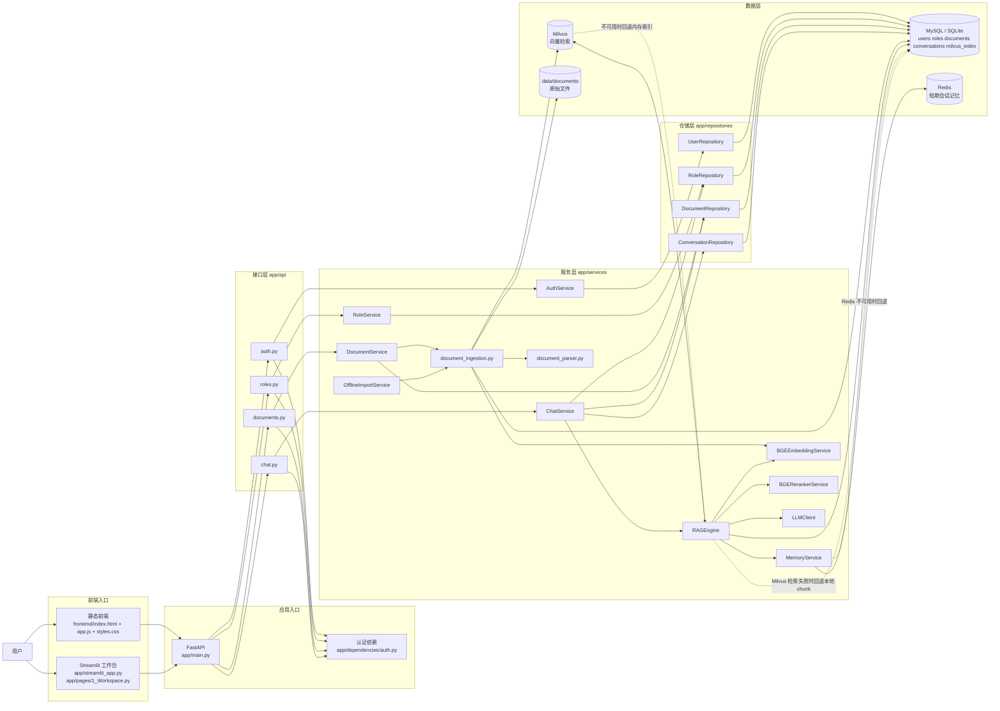
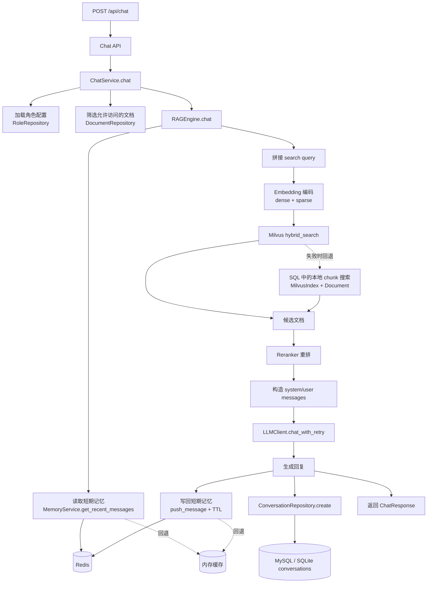
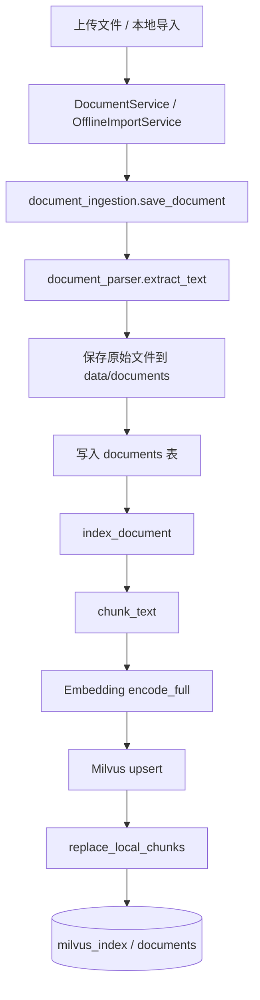

# 技术架构图

基于当前代码结构生成，覆盖双前端入口、FastAPI API 层、服务层、RAG 核心链路、数据存储以及文档入库流程。

## 1. 总体架构图

## 2. 在线对话 RAG 链路

## 3. 文档入库链路

## 4. 代码对应关系

- 应用入口：`app/main.py`
- 静态前端：`frontend/`
- Streamlit 工作台：`app/streamlit_app.py`、`app/pages/1_Workspace.py`
- API 层：`app/api/*.py`
- 服务层：`app/services/*.py`
- 仓储层：`app/repositories/*.py`
- 数据访问：`app/database/mysql_client.py`、`app/database/milvus_client.py`
- 短期记忆：`app/services/memory.py`

