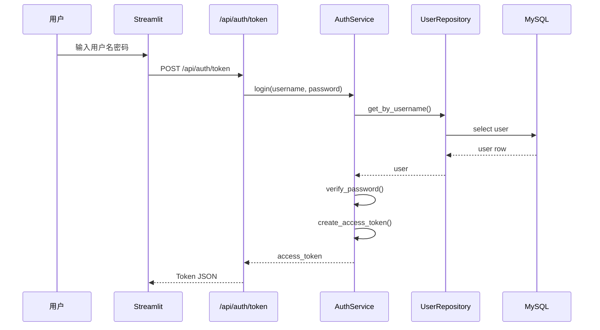
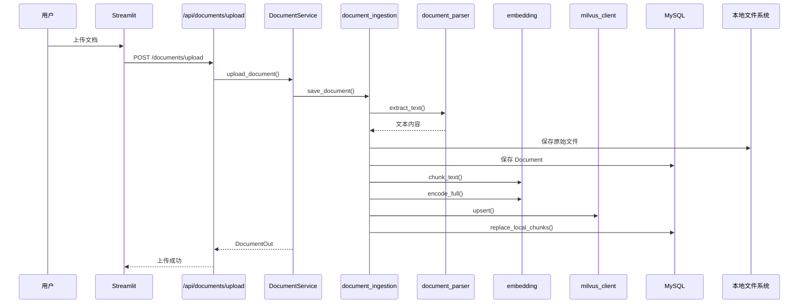
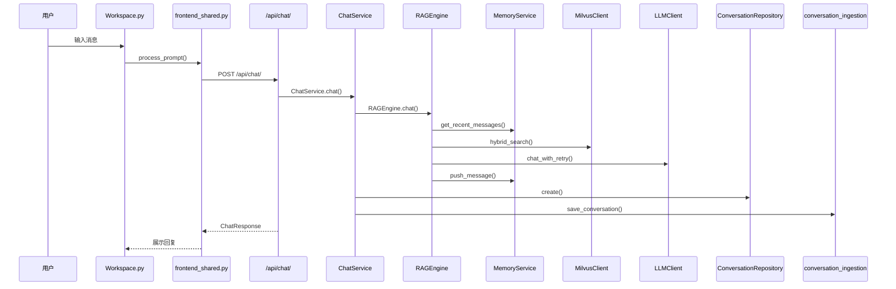
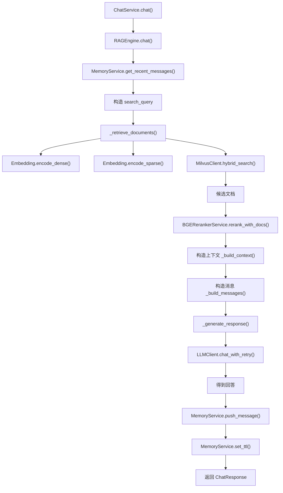
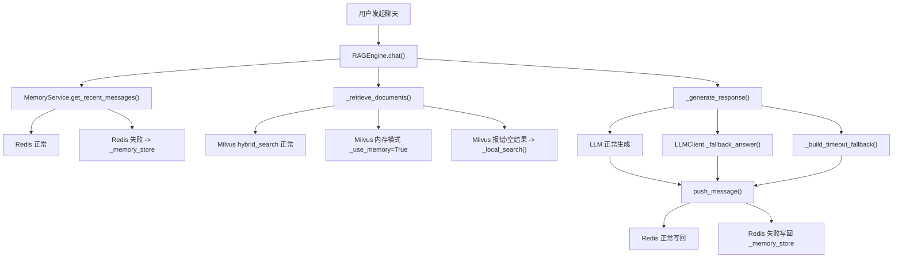
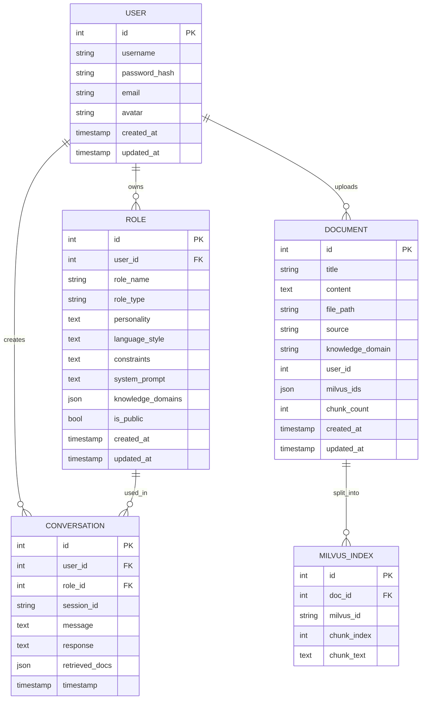
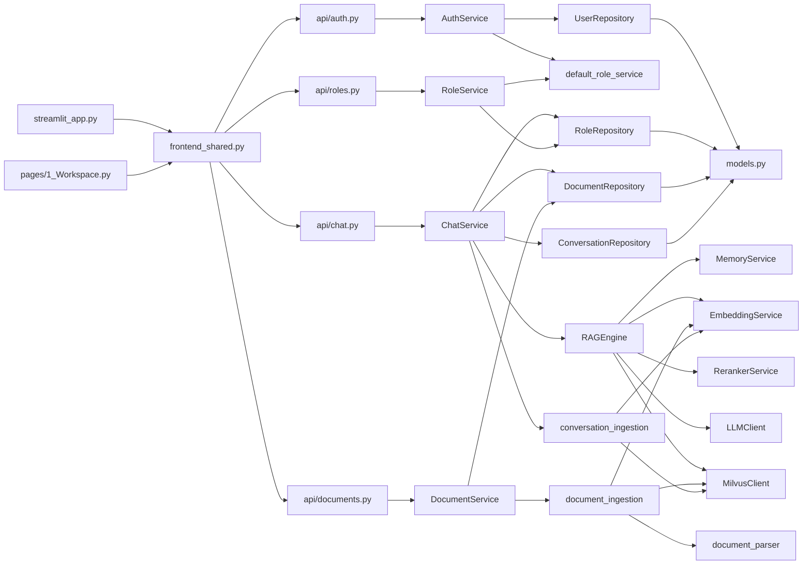

# 项目详细架构图

本文档用于说明当前项目的整体架构、模块分层、核心调用链、RAG 检索生成链路、离线降级链路、数据库结构与文件职责。

项目根目录：`生成`

---

## 1. 项目总体定位

这是一个基于 `Streamlit + FastAPI + SQLAlchemy + MySQL + Milvus + Redis` 的多角色对话系统。

系统支持：

1. 用户注册、登录、鉴权
2. 角色创建、角色管理、默认角色注入
3. 文档上传、解析、切块、索引
4. 基于角色设定和知识库的 RAG 对话
5. 会话短期记忆
6. Milvus / Redis / LLM 不可用时的离线或本地降级

---

## 2. 总体分层架构图

```mermaid
flowchart TB
    U[用户]

    subgraph Frontend["前端层"]
        S1["Streamlit 登录页\napp/streamlit_app.py"]
        S2["Streamlit 工作台\napp/pages/1_Workspace.py"]
        FS["前端共享请求与状态\napp/frontend_shared.py"]
        UI["UI 组件与主题\napp/ui_components.py\napp/frontend_shared.py"]
    end

    subgraph Backend["后端接口层 FastAPI"]
        M["应用入口\napp/main.py"]
        A1["认证接口\napp/api/auth.py"]
        A2["聊天接口\napp/api/chat.py"]
        A3["文档接口\napp/api/documents.py"]
        A4["角色接口\napp/api/roles.py"]
        D1["鉴权依赖\napp/dependencies/auth.py"]
    end

    subgraph Service["服务层"]
        AS["AuthService\napp/services/auth_service.py"]
        CS["ChatService\napp/services/chat_service.py"]
        RS["RAGEngine\napp/services/rag_engine.py"]
        DS["DocumentService\napp/services/document_service.py"]
        RLS["RoleService\napp/services/role_service.py"]
        DRS["DefaultRoleService\napp/services/default_role_service.py"]
        MIS["MemoryService\napp/services/memory.py"]
        EBS["EmbeddingService\napp/services/embedding.py"]
        RKS["RerankerService\napp/services/reranker.py"]
        LLM["LLMClient\napp/services/llm_client.py"]
        DIG["DocumentIngestion\napp/services/document_ingestion.py"]
        CIG["ConversationIngestion\napp/services/conversation_ingestion.py"]
        OIS["OfflineImportService\napp/services/offline_import_service.py"]
        DPG["DocumentParser\napp/services/document_parser.py"]
    end

    subgraph Repo["仓储层 Repository"]
        UR["UserRepository"]
        RR["RoleRepository"]
        DR["DocumentRepository"]
        CR["ConversationRepository"]
    end

    subgraph Data["数据与基础设施层"]
        CFG["配置中心\napp/config.py"]
        DB["MySQL / SQLite\nSQLAlchemy Models"]
        MIL["Milvus / 内存降级"]
        RED["Redis / 内存降级"]
        DOCS["本地文档目录\ndata/documents"]
    end

    U --> S1
    U --> S2
    S1 --> FS
    S2 --> FS
    FS --> A1
    FS --> A2
    FS --> A3
    FS --> A4

    M --> A1
    M --> A2
    M --> A3
    M --> A4
    A1 --> AS
    A2 --> CS
    A3 --> DS
    A4 --> RLS
    D1 --> AS

    AS --> UR
    AS --> DRS
    CS --> RR
    CS --> DR
    CS --> CR
    CS --> RS
    DS --> DR
    DS --> DIG
    RLS --> RR
    DRS --> RR
    RS --> MIS
    RS --> EBS
    RS --> RKS
    RS --> LLM
    RS --> MIL
    DIG --> DPG
    DIG --> EBS
    DIG --> MIL
    CIG --> EBS
    CIG --> MIL

    UR --> DB
    RR --> DB
    DR --> DB
    CR --> DB
    MIS --> RED
    MIS --> DB
    DIG --> DOCS
    CFG --> M
    CFG --> AS
    CFG --> CS
    CFG --> RS
    CFG --> DIG
```



---

## 3. 目录结构图

```text
生成/
├─ app/
│  ├─ main.py
│  ├─ config.py
│  ├─ streamlit_app.py
│  ├─ frontend_shared.py
│  ├─ ui_components.py
│  ├─ api/
│  │  ├─ auth.py
│  │  ├─ chat.py
│  │  ├─ documents.py
│  │  └─ roles.py
│  ├─ dependencies/
│  │  └─ auth.py
│  ├─ schemas/
│  │  ├─ auth.py
│  │  ├─ chat.py
│  │  ├─ document.py
│  │  └─ role.py
│  ├─ services/
│  │  ├─ auth_service.py
│  │  ├─ chat_service.py
│  │  ├─ rag_engine.py
│  │  ├─ memory.py
│  │  ├─ llm_client.py
│  │  ├─ embedding.py
│  │  ├─ reranker.py
│  │  ├─ document_service.py
│  │  ├─ document_ingestion.py
│  │  ├─ document_parser.py
│  │  ├─ role_service.py
│  │  ├─ default_role_service.py
│  │  ├─ conversation_ingestion.py
│  │  └─ offline_import_service.py
│  ├─ repositories/
│  │  ├─ user_repository.py
│  │  ├─ role_repository.py
│  │  ├─ document_repository.py
│  │  └─ conversation_repository.py
│  ├─ database/
│  │  ├─ models.py
│  │  ├─ mysql_client.py
│  │  └─ milvus_client.py
│  ├─ prompts/
│  │  └─ templates.py
│  ├─ core/
│  │  └─ role_defaults.py
│  └─ pages/
│     └─ 1_Workspace.py
├─ frontend/
├─ data/
│  └─ documents/
├─ docs/
└─ assets/
```

---

## 4. 核心模块职责

### 4.1 前端层

#### `app/streamlit_app.py`

职责：

1. 登录页与注册页入口
2. 后端健康检查展示
3. 登录成功后跳转工作台

#### `app/pages/1_Workspace.py`

职责：

1. 工作台页面
2. 角色切换与多角色会话
3. 文档上传入口
4. 对话展示与消息发送

#### `app/frontend_shared.py`

职责：

1. 封装对 FastAPI 的 HTTP 调用
2. 管理前端 session state
3. 统一登录、注册、发消息、上传文档、刷新文档
4. 多角色并发调用聊天接口

#### `app/ui_components.py`

职责：

1. 页面视觉组件
2. 状态条、标签云、空状态面板等 UI 复用

---

### 4.2 后端入口层

#### `app/main.py`

职责：

1. 创建 FastAPI 应用
2. 注册 `auth/chat/documents/roles` 路由
3. 注入 CORS
4. 生命周期里初始化数据库
5. 提供 `/health`
6. 如果 `frontend/` 存在，提供静态前端

---

### 4.3 API 接口层

#### `app/api/auth.py`

职责：

1. 注册
2. 登录换 Token
3. 获取当前用户

#### `app/api/chat.py`

职责：

1. 提供聊天接口 `/api/chat/`
2. 懒加载 `RAGEngine`
3. 把请求交给 `ChatService`

#### `app/api/documents.py`

职责：

1. 上传文档
2. 列出文档
3. 获取文档详情
4. 更新文档
5. 删除文档

#### `app/api/roles.py`

职责：

1. 创建角色
2. 列出角色
3. 查看角色
4. 更新角色
5. 删除角色

---

### 4.4 依赖与鉴权层

#### `app/dependencies/auth.py`

职责：

1. 使用 `OAuth2PasswordBearer`
2. 从请求头提取 Bearer Token
3. 调用 `AuthService.get_current_user_from_token()`
4. 返回当前用户对象给受保护接口

---

### 4.5 服务层

#### `app/services/auth_service.py`

职责：

1. 注册用户
2. 用户认证
3. 登录签发 JWT
4. 根据 JWT 解析当前用户
5. 注册后补全默认角色

依赖：

1. `UserRepository`
2. `default_role_service.ensure_user_default_roles`
3. `schemas/auth.py` 中的密码和 Token 工具

#### `app/services/role_service.py`

职责：

1. 角色 CRUD
2. 角色所有权校验
3. 角色类型规范化
4. 自动确保用户拥有默认角色

依赖：

1. `RoleRepository`
2. `default_role_service.ensure_user_default_roles`

#### `app/services/default_role_service.py`

职责：

1. 根据 `core/role_defaults.py` 为用户补齐内置角色
2. 确保 `friend/doctor/assistant` 等默认角色存在

#### `app/services/document_service.py`

职责：

1. 文档列表查询
2. 文档详情查询
3. 文档上传
4. 文档更新
5. 文档删除

依赖：

1. `DocumentRepository`
2. `document_ingestion.save_document`
3. `document_ingestion.get_milvus`

#### `app/services/document_ingestion.py`

职责：

1. 保存上传文档
2. 解析文本
3. 切块
4. 生成向量
5. 写入 Milvus
6. 写入本地 `MilvusIndex` 表

这是文档入库链路的核心模块。

#### `app/services/document_parser.py`

职责：

1. 解析 `txt / md / pdf / docx`
2. 抽取原始文本

#### `app/services/chat_service.py`

职责：

1. 解析聊天请求
2. 组装角色配置
3. 计算允许访问的文档范围
4. 调用 `RAGEngine.chat()`
5. 保存 conversation 记录
6. 异步把 conversation 再写入对话向量索引

依赖：

1. `RoleRepository`
2. `DocumentRepository`
3. `ConversationRepository`
4. `core/role_defaults.py`
5. `conversation_ingestion.save_conversation`
6. `RAGEngine`

#### `app/services/rag_engine.py`

职责：

1. 读取短期记忆
2. 构造搜索 query
3. 检索知识片段
4. 重排知识片段
5. 组装 prompt
6. 调用 LLM
7. 回写短期记忆

这是整个 RAG 核心引擎。

#### `app/services/memory.py`

职责：

1. 会话记忆写入
2. 最近消息读取
3. 全量会话读取
4. 会话清理
5. TTL 设置

优先 Redis，失败时退回进程内 `_memory_store`。

#### `app/services/embedding.py`

职责：

1. 文本切块
2. 稠密向量编码
3. 稀疏向量编码
4. 全量编码

特点：

1. 支持 `FlagEmbedding`
2. 支持 `SentenceTransformer`
3. 若都不可用，退回哈希特征向量

#### `app/services/reranker.py`

职责：

1. 对候选文档重排
2. 支持 `FlagEmbedding` reranker
3. 支持 HuggingFace sequence classification reranker
4. 若都不可用，退回词重合度打分

#### `app/services/llm_client.py`

职责：

1. 封装兼容 OpenAI 接口的聊天调用
2. 处理超时和重试
3. 处理 DeepSeek 特殊参数
4. 当模型不可用时给出 fallback answer

#### `app/services/conversation_ingestion.py`

职责：

1. 把对话记录构造为文本
2. 切块
3. 嵌入
4. 写入单独的会话向量集合

用途：

1. 后续可用于长期记忆或对话历史检索

#### `app/services/offline_import_service.py`

职责：

1. 离线导入本地文件
2. 调用 `upsert_local_file()` 完成入库

---

### 4.6 仓储层

仓储层的作用是把服务层和数据库访问解耦。

#### `app/repositories/user_repository.py`

职责：

1. 按用户名查询用户
2. 创建用户

#### `app/repositories/role_repository.py`

职责：

1. 按 ID 查询角色
2. 统计用户角色数
3. 查询用户可见角色
4. 保存角色
5. 删除角色

#### `app/repositories/document_repository.py`

职责：

1. 按 ID 查询文档
2. 查询用户文档列表
3. 根据用户与知识域返回文档 ID 列表

#### `app/repositories/conversation_repository.py`

职责：

1. 保存一轮对话记录

---

### 4.7 数据层

#### `app/database/models.py`

定义数据表：

1. `User`
2. `Role`
3. `Conversation`
4. `Document`
5. `MilvusIndex`

#### `app/database/mysql_client.py`

职责：

1. 初始化数据库引擎
2. 创建异步 session maker
3. 应用启动时建表
4. 兼容 MySQL / SQLite
5. 提供 `get_db()` 依赖

#### `app/database/milvus_client.py`

职责：

1. 封装 Milvus 连接
2. 集合初始化
3. hybrid search
4. upsert
5. delete_by_doc_id

特性：

1. 连接 Milvus 失败时，启用内存 `_memory_store`
2. 支持内存模式下的简化向量检索

---

### 4.8 配置层

#### `app/config.py`

集中管理：

1. 应用名与版本
2. 数据目录
3. 数据库配置
4. Redis 配置
5. Milvus 配置
6. LLM 配置
7. Embedding 与 reranker 配置
8. 检索参数
9. chunk 参数
10. JWT 配置
11. 默认角色配置

---

### 4.9 Prompt 与角色核心规则层

#### `app/prompts/templates.py`

职责：

1. 维护不同角色的 prompt 模板
2. 根据角色配置拼接 system prompt

#### `app/core/role_defaults.py`

职责：

1. 维护默认角色 profile
2. 构造角色默认配置
3. 构造有效知识域列表

---

## 5. 后端请求链路图

### 5.1 登录链路



---

### 5.2 文档上传链路



---

### 5.3 聊天主链路



---

## 6. RAG 内部链路图



---

## 7. 离线降级架构图

这是本项目最重要的容错设计。



---

## 8. 数据模型关系图



---

## 9. 角色系统架构

角色系统由三部分组成：

1. 默认角色定义
2. 用户自定义角色
3. 聊天时的角色配置融合

### 9.1 默认角色来源

文件：

1. `app/core/role_defaults.py`
2. `app/prompts/templates.py`
3. `app/services/default_role_service.py`

### 9.2 运行逻辑

1. 用户注册后，`ensure_user_default_roles()` 自动插入默认角色
2. 前端默认也有 `friend / doctor / assistant` 对应的快捷配置
3. 聊天时 `ChatService._get_role_config()` 会读取数据库角色
4. 如果取不到，就退回配置默认值
5. 如果前端传入 `role_config_override`，再覆盖基础角色配置

### 9.3 角色配置参与 RAG 的位置

角色配置影响：

1. prompt 内容
2. knowledge domain 过滤
3. 风格与约束
4. 回答边界

---

## 10. 文档知识库架构

文档知识库分成三层：

1. 原始文件层
2. 结构化文档层
3. 向量索引层

### 10.1 原始文件层

目录：

`data/documents/`

作用：

1. 保存上传后的原始文件副本
2. 文件名加入用户 ID 和时间戳，避免冲突

### 10.2 结构化文档层

表：

`Document`

保存：

1. 标题
2. 原始全文文本
3. 知识域
4. 文件路径
5. chunk 数量
6. milvus 主键列表

### 10.3 向量索引层

外部：

1. Milvus 正式向量索引

本地：

1. `MilvusIndex` 表保存 chunk_text
2. 可作为本地检索降级来源

---

## 11. 记忆系统架构

记忆系统分两类：

1. 短期记忆
2. 对话持久化与长期索引雏形

### 11.1 短期记忆

模块：

`app/services/memory.py`

存储策略：

1. 首选 Redis
2. Redis 不可用时用 `_memory_store`

粒度：

键格式：

`session:{user_id}:{role_id}:{session_id}`

内容：

1. user message
2. assistant message
3. timestamp

### 11.2 对话持久化

模块：

1. `ConversationRepository`
2. `conversation_ingestion.py`

作用：

1. 每轮聊天保存到 `Conversation`
2. 同时把 conversation 再切块和向量化
3. 存入单独的 Milvus 会话集合

这可以视为长期记忆扩展点。

---

## 12. 配置与运行时参数架构

集中在：

`app/config.py`

可配置内容包括：

1. `DATABASE_URL`
2. `MYSQL_HOST / PORT / USER / PASSWORD / DATABASE`
3. `REDIS_HOST / PORT / PASSWORD`
4. `MILVUS_HOST / PORT / COLLECTION_NAME`
5. `LLM_BASE_URL / API_KEY / MODEL`
6. `BGE_EMBEDDING_MODEL`
7. `BGE_RERANKER_MODEL`
8. `ENABLE_FLAGEMBEDDING`
9. `ENABLE_FLAGRERANKER`
10. `EMBEDDING_DIM`
11. `CHUNK_SIZE / CHUNK_OVERLAP`
12. `RETRIEVAL_TOP_K / RERANK_TOP_K`
13. `LLM_MAX_TOKENS / TEMPERATURE / TIMEOUT`
14. `SHORT_TERM_MAX_LEN / SHORT_TERM_TTL`
15. `SECRET_KEY / ALGORITHM`

---

## 13. 详细模块调用关系图



---

## 14. 朋友角色的详细聊天链路

以默认朋友角色 `friend` 为例，完整调用路径是：

1. `app/pages/1_Workspace.py` -> `process_prompt(...)`
2. `app/frontend_shared.py` -> `send_multi_role_chat(...)`
3. `app/frontend_shared.py` -> `_run_role_chat(...)`
4. `app/frontend_shared.py` -> `send_chat(...)`
5. `app/api/chat.py` -> `chat(...)`
6. `app/services/chat_service.py` -> `ChatService.chat(...)`
7. `app/services/chat_service.py` -> `_get_role_config(...)`
8. `app/core/role_defaults.py` -> `build_default_role_config(...)`
9. `app/core/role_defaults.py` -> `build_effective_knowledge_domains(...)`
10. `app/repositories/document_repository.py` -> `list_doc_ids_by_user_and_domains(...)`
11. `app/services/rag_engine.py` -> `RAGEngine.chat(...)`
12. `app/services/memory.py` -> `get_recent_messages(...)`
13. `app/services/rag_engine.py` -> `_build_search_query(...)`
14. `app/services/rag_engine.py` -> `_retrieve_documents(...)`
15. `app/database/milvus_client.py` -> `hybrid_search(...)`
16. 如果失败则 `app/services/rag_engine.py` -> `_local_search(...)`
17. `app/services/reranker.py` -> `rerank_with_docs(...)`
18. `app/services/rag_engine.py` -> `_build_messages(...)`
19. `app/prompts/templates.py` -> `get_role_prompt(...)`
20. `app/services/rag_engine.py` -> `_generate_response(...)`
21. `app/services/llm_client.py` -> `chat_with_retry(...)`
22. `app/services/memory.py` -> `push_message(...)`
23. `app/services/memory.py` -> `set_ttl(...)`
24. `app/repositories/conversation_repository.py` -> `create(...)`
25. `app/services/conversation_ingestion.py` -> `save_conversation(...)`

---

## 15. 这个项目的架构特点总结

### 优点

1. 分层清晰：前端、接口、服务、仓储、数据层边界明确
2. RAG 链路完整：文档入库、检索、重排、生成、记忆都有
3. 角色系统明确：默认角色、可扩展角色、自定义覆盖都存在
4. 容错设计强：Redis、Milvus、LLM 都有降级
5. 前后端联动简单：Streamlit 直接驱动 FastAPI API

### 关键设计点

1. `ChatService` 负责业务编排
2. `RAGEngine` 负责检索生成核心逻辑
3. `document_ingestion.py` 负责知识库入库主流程
4. `memory.py` 负责短期记忆
5. `milvus_client.py` 和 `llm_client.py` 负责基础设施适配与降级

### 当前架构风格

这是一个：

`单体应用 + 分层架构 + 面向服务模块 + 带本地降级的轻量 RAG 系统`

---

## 16. 如果你要在答辩里一句话介绍

可以直接说：

> 这个项目采用 Streamlit 作为交互前端、FastAPI 作为后端接口层、Service + Repository 作为业务分层、MySQL 作为结构化存储、Milvus 作为向量检索、Redis 作为短期记忆缓存，并在检索、记忆和生成三个环节设计了本地降级链路，形成了一个支持多角色、多文档、多轮对话的 RAG 架构。

