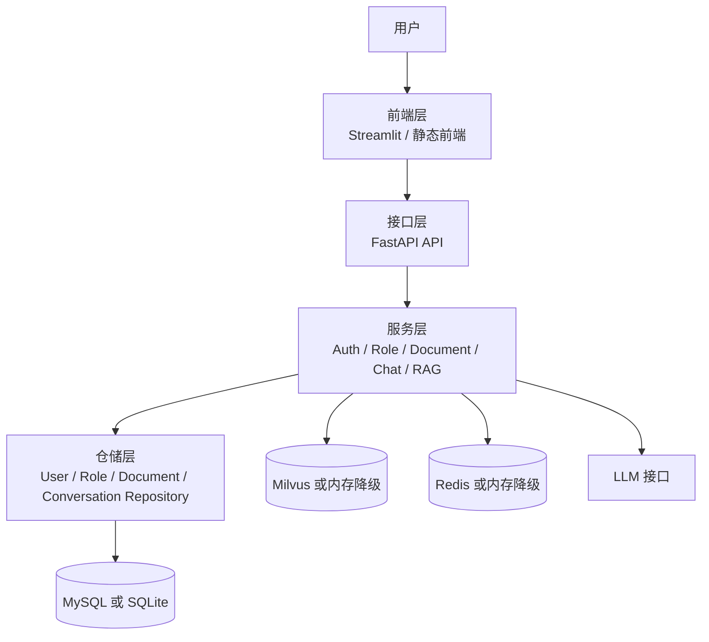
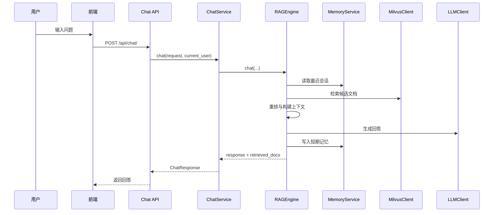
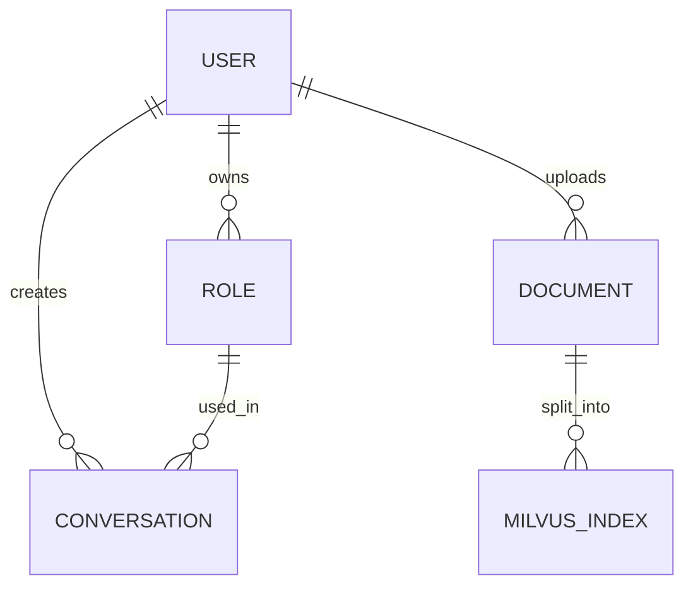

# 角色扮演系统设计文档

## 1. 文档目的

本文档基于当前项目实际代码整理，用于说明系统的设计目标、核心架构、模块职责、数据模型、关键流程与后续扩展方向。

项目当前代码主体位于 `研发` 目录，系统以“多角色对话 + 文档知识库 + RAG 检索增强”为核心能力，支持用户登录、角色管理、文档上传、知识检索与多轮对话。

## 2. 系统定位

本系统是一个面向角色扮演场景的知识增强对话平台，目标是在不同角色设定下，为用户提供具备上下文记忆、知识检索和风格约束的连续对话能力。

系统主要解决以下问题：

- 让同一用户能够维护多个角色视角
- 让角色回答不只依赖大模型，而是结合上传文档进行回答
- 让系统在 Redis、Milvus、在线 LLM 不可用时仍具备降级可用能力

## 3. 设计目标

### 3.1 功能目标

- 支持注册、登录与鉴权
- 支持角色创建、编辑、查询与删除
- 支持知识文档上传、解析、切块、入库与删除
- 支持基于角色配置和知识域过滤的 RAG 问答
- 支持多轮对话与会话隔离

### 3.2 架构目标

- 前后端边界清晰，接口统一走 HTTP API
- 业务逻辑集中在服务层，避免路由层过重
- 数据访问通过仓储层收口，降低耦合
- 外部依赖失败时可降级，不因单点依赖导致整站不可用

### 3.3 可扩展目标

- 后续可接入更多角色模板
- 后续可接入更多文档类型或解析器
- 后续可把短期记忆扩展成长短期混合记忆
- 后续可平滑替换为本地模型、云模型或混合推理架构

## 4. 总体架构

系统采用分层单体架构，核心由前端层、接口层、服务层、仓储层、数据与基础设施层组成。



## 5. 技术选型

当前项目的主要技术组件如下：

- 后端框架：`FastAPI`
- 前端形态：`Streamlit` + `FastAPI` 托管静态前端
- ORM：`SQLAlchemy`
- 关系型数据库：`SQLite` 或 `MySQL`
- 向量检索：`Milvus`
- 会话缓存：`Redis`
- 大模型接口：OpenAI 兼容接口
- 向量模型与重排模型：`BGE / FlagEmbedding / SentenceTransformers`

选型原因：

- `FastAPI` 适合快速构建 API，结构清晰
- `Streamlit` 适合快速构建工作台和内部验证界面
- `SQLAlchemy` 便于兼容 `SQLite` 与 `MySQL`
- `Milvus` 适合做稠密与稀疏混合检索
- `Redis` 适合做短期会话记忆

## 6. 目录与模块设计

### 6.1 顶层目录

- `研发/`：主工程目录
- `部署/`：部署文档
- `设计/`：设计文档

### 6.2 研发目录内部结构

```text
研发/
  app/
    api/
    core/
    database/
    dependencies/
    pages/
    prompts/
    repositories/
    schemas/
    services/
    config.py
    main.py
    streamlit_app.py
    frontend_shared.py
    ui_components.py
  frontend/
  data/
  docs/
```

### 6.3 模块职责

#### 前端层

- `app/streamlit_app.py`：登录与注册入口
- `app/pages/1_Workspace.py`：工作台页面，负责角色切换、消息发送、文档上传
- `frontend/`：静态前端资源，由 `FastAPI` 根路径托管
- `app/frontend_shared.py`：前端公共请求、状态管理与多角色调用封装

#### 接口层

- `app/api/auth.py`：注册、登录、当前用户
- `app/api/chat.py`：聊天接口
- `app/api/documents.py`：文档上传与管理
- `app/api/roles.py`：角色管理

#### 服务层

- `auth_service.py`：用户注册、登录、Token 解析
- `role_service.py`：角色增删改查与默认角色保障
- `document_service.py`：文档业务编排
- `document_ingestion.py`：文档解析、切块、向量化、索引写入
- `chat_service.py`：聊天业务主入口
- `rag_engine.py`：RAG 核心引擎
- `memory.py`：会话短期记忆
- `llm_client.py`：LLM 访问适配器
- `embedding.py`：向量编码与分块
- `reranker.py`：重排逻辑
- `conversation_ingestion.py`：对话记录向量化

#### 仓储层

- `user_repository.py`
- `role_repository.py`
- `document_repository.py`
- `conversation_repository.py`

职责是只负责数据读写，不承载复杂业务决策。

#### 数据与配置层

- `database/models.py`：关系模型定义
- `database/mysql_client.py`：数据库连接与建表
- `database/milvus_client.py`：Milvus 访问与内存降级
- `config.py`：统一配置中心

## 7. 核心业务设计

### 7.1 用户与认证

认证链路如下：

1. 用户通过前端提交用户名和密码
2. `auth.py` 接收请求
3. `AuthService` 校验用户信息
4. 登录成功后签发 JWT
5. 受保护接口通过 `dependencies/auth.py` 从 Bearer Token 中解析当前用户

设计特点：

- 鉴权逻辑统一，不分散在各接口内部
- 登录成功后前端保存 Token，再访问受保护资源

### 7.2 角色系统

角色系统是本项目的核心业务抽象。每个角色具有如下配置能力：

- 角色名称
- 角色类型
- 性格设定
- 语言风格
- 回答约束
- 知识域范围
- 是否公开

设计要点：

- 支持系统默认角色与用户自定义角色并存
- `ChatService` 会先取数据库中的角色配置
- 若角色不存在，则回退到默认角色配置
- 请求还可通过 `role_config_override` 临时覆盖当前角色配置

### 7.3 文档知识库

文档知识库用于为角色回答提供可检索的外部知识。

支持格式：

- `txt`
- `md`
- `pdf`
- `docx`

文档入库流程：

1. 上传文件
2. 解析文本
3. 按块切分
4. 生成稠密与稀疏向量
5. 写入 Milvus
6. 将文档元数据与本地切块副本写入关系数据库

这样设计的原因：

- 保留原始文档与结构化元数据
- 即使 Milvus 不可用，仍可通过本地切块做降级检索

### 7.4 聊天与 RAG

聊天流程由 `ChatService` 与 `RAGEngine` 协作完成。



RAG 核心步骤：

1. 读取当前会话最近消息
2. 用用户问题和会话上下文构造搜索语句
3. 根据角色知识域过滤文档范围
4. 执行 Milvus 混合检索
5. 使用 reranker 重排结果
6. 组装上下文与角色提示词
7. 调用 LLM 生成回答
8. 保存短期记忆与会话记录

## 8. 数据模型设计

当前关系模型主要包含以下实体。

### 8.1 User

用途：

- 存储系统用户信息

关键字段：

- `id`
- `username`
- `password_hash`
- `email`
- `avatar`

### 8.2 Role

用途：

- 存储角色设定

关键字段：

- `id`
- `user_id`
- `role_name`
- `role_type`
- `personality`
- `language_style`
- `constraints`
- `system_prompt`
- `knowledge_domains`
- `is_public`

### 8.3 Document

用途：

- 存储上传文档元数据与全文文本

关键字段：

- `id`
- `title`
- `content`
- `file_path`
- `source`
- `knowledge_domain`
- `user_id`
- `milvus_ids`
- `chunk_count`

### 8.4 MilvusIndex

用途：

- 保存本地切块副本与 Milvus 映射关系

关键字段：

- `doc_id`
- `milvus_id`
- `chunk_index`
- `chunk_text`

### 8.5 Conversation

用途：

- 保存聊天记录

关键字段：

- `user_id`
- `role_id`
- `session_id`
- `message`
- `response`
- `retrieved_docs`
- `timestamp`

### 8.6 实体关系



## 9. 记忆与降级设计

系统在多个关键环节实现了容错。

### 9.1 Redis 降级

- 优先使用 Redis 存储短期记忆
- 若 Redis 初始化失败或调用异常，则退回进程内 `_memory_store`

影响：

- 不影响聊天主流程
- 但服务重启后内存中的短期记忆会丢失

### 9.2 Milvus 降级

- 优先使用 Milvus 检索
- 若 Milvus 不可用，则退回本地数据库切块检索

影响：

- 不影响基本问答
- 但检索性能与召回质量可能下降

### 9.3 LLM 降级

- 若远程 LLM 不可用，`LLMClient` 会给出 fallback answer
- 若生成超时，`RAGEngine` 会根据已检索文档构造降级回复

设计意义：

- 系统可“有损可用”
- 对于内部系统或演示环境非常重要

## 10. 提示词与角色控制设计

提示词系统由 `prompts/templates.py` 和 `core/role_defaults.py` 共同支撑。

设计思路：

- 角色不是单纯的标签，而是完整的行为约束集合
- 大模型输入不仅包含用户问题，还包含角色设定、检索到的知识和对话历史

角色配置影响以下内容：

- 回答风格
- 角色人格
- 允许使用的知识域
- 回答约束与风险边界

## 11. 接口设计概览

主要接口如下：

- `POST /api/auth/register`
- `POST /api/auth/token`
- `GET /api/auth/me`
- `GET /api/roles/`
- `POST /api/roles/`
- `PUT /api/roles/{role_id}`
- `DELETE /api/roles/{role_id}`
- `GET /api/documents/`
- `POST /api/documents/upload`
- `PUT /api/documents/{doc_id}`
- `DELETE /api/documents/{doc_id}`
- `POST /api/chat/`
- `GET /health`

设计原则：

- 接口层只负责参数收发和异常转换
- 业务逻辑统一下沉到服务层

## 12. 非功能设计

### 12.1 可维护性

- 采用分层架构
- 目录职责明确
- 公共配置集中管理

### 12.2 可测试性

- 服务层与仓储层已基本分离
- 后续可补充接口测试、服务测试和检索链路测试

### 12.3 可扩展性

- 模型、向量库、缓存均通过服务适配
- 便于替换外部组件

### 12.4 可用性

- Redis、Milvus、LLM 均支持失败降级
- 基础链路不会因单一依赖异常完全中断

## 13. 当前设计优势

- 业务主线清晰，围绕“角色 + 知识 + 对话”展开
- 后端职责拆分合理，`ChatService` 与 `RAGEngine` 分工明确
- 兼顾研发效率与可用性，适合快速迭代
- 降级链路完整，适合演示、本地验证和逐步上线

## 14. 当前设计限制

基于当前实现，仍有以下限制：

- `Streamlit` 与静态前端同时存在，前端形态略有并行
- 数据库迁移体系还不完整，当前主要依赖启动建表
- 权限模型较轻，尚未细分更复杂的文档共享和角色协作场景
- 长期记忆能力仍处于可扩展阶段

## 15. 后续优化建议

### 15.1 架构方向

- 统一前端形态，明确保留静态前端或 Streamlit 的主入口
- 引入数据库迁移工具，如 Alembic
- 为对话、文档、角色增加更细粒度权限控制

### 15.2 RAG 方向

- 增强查询改写与多路召回
- 引入文档版本管理
- 引入命中评估、检索日志与质量分析能力

### 15.3 工程方向

- 增加自动化测试
- 增加统一日志与链路追踪
- 增加配置分环境管理

## 16. 总结

该项目当前采用的是一套适合中小型智能应用的分层单体架构：以前端工作台和 FastAPI API 为入口，以服务层组织业务，以关系数据库、Milvus、Redis 和 LLM 共同支撑 RAG 对话能力。

从设计上看，这个系统最有价值的点不只是“能聊天”，而是把“角色设定、知识约束、检索增强、记忆管理、容错降级”整合进了同一条业务链路里。这使它具备继续向专业顾问、教育辅导、陪伴式助手等方向扩展的良好基础。

